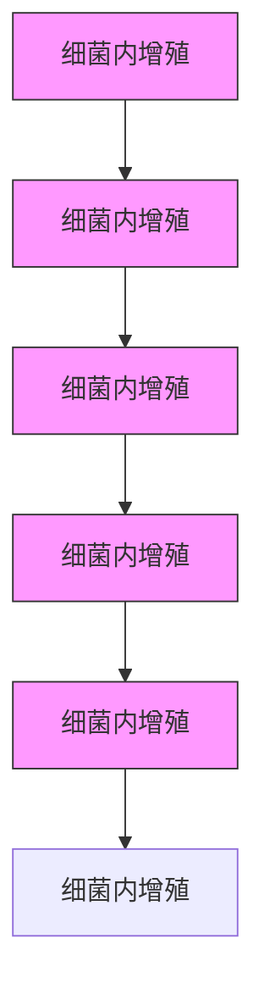
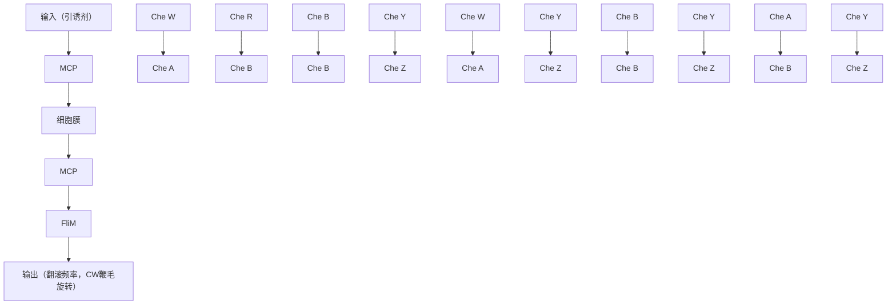

# 问题

趋药性是指能运动的细菌感知自身所处环境并朝着更适宜的环境趋近的过程。趋药性对细胞的正常运作有着重要作用。大肠杆菌会比较当前引诱剂浓度与过去的引诱剂浓度。如果它检测到引诱剂浓度增高，它就会向浓度高的方向趋近。为了实现趋近，它会降低翻滚频率，从而使得运动的时间变长。相反，如果它检测到排斥剂的浓度有所增加，大肠杆菌会趋向相反的方向；因此，大肠杆菌会通过增加翻滚频率来试图改变方向，远离排斥剂。这种趋药性动力学是我们研究的重点。

系统生物学的研究人员已经对几种不同类型细菌的趋药性进行了研究。我们基于其中的两种（Barkai & Libler，1997年；Yi等人，2000），对不同蛋白质的趋药反应进行了很细致的研究，并且它们之间相互影响的细节特征如图10.81所示。生物学家给参与趋药性的蛋白质进行了命名，由英文字母“Che”作为前缀（例如，Che A，Che B）。在生物学中，信号传导是细胞外的分子刺激物与细胞膜上的受体蛋白质进行反应的过程，反过来又刺激细胞内的“第二信使”蛋白质，从而使得细胞完成某些工作（例如基因表达，蛋白质合成）。细菌的表面是一类受体蛋白称为MCP，或叫甲基受体趋化性蛋白质。MCP包括胞外、跨膜和胞内的区域，这意味着它们有可以感知细胞外化学刺激物的子结构，并且随后刺激细胞内的蛋白质。这些化学物质构成对系统的输入，并统称为配体。系统通过控制蛋白质 Che Y 的活性来控制翻滚频率，这种蛋白质直接作用于鞭毛的电动机上。

text_image

细胞壁
质膜

图 10.79 鞭毛电动机顺时针转动大肠杆菌翻滚效果图

flowchart

图 10.80 大肠杆菌有趋药性的随机游走运动

flowchart

图 10.81 大肠杆菌趋药性信号的传导途径
