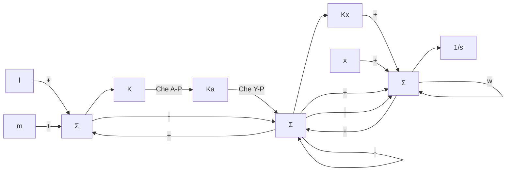
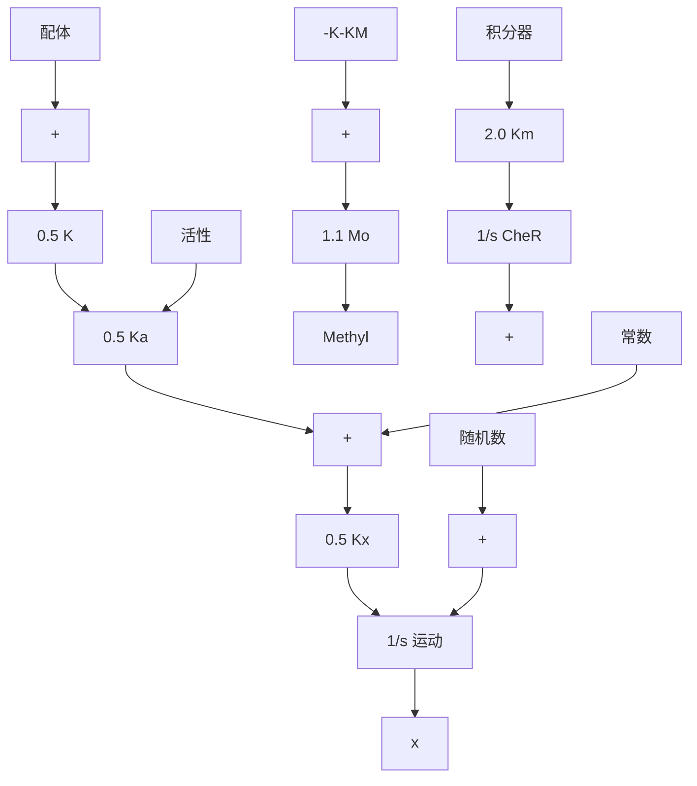

# 模型

我们需要考虑的问题就是如何建立一个模型作为控制系统框图，从而描述在这种趋药性环境下大肠杆菌的平均运动。我们用平均值代表在鞭毛中只有一个和蛋白质相互作用的受体复合物。研究表明，系统方程是复杂和高度非线性的。此外，细菌表面包含数百个受体复合物，并且它们之间的相互作用已经在图10.81中显示出来。就我们的研究而言，框图中变量均选为线性小信号的平均偏差，其偏差值与均衡值不同。输入为配体的浓度，引诱剂是正值且排斥剂是负值。系统的输出是Che A-P的活性和在x轴方向的移动情况。对模型进行参数匹配得到的曲线与图10(Mello等，2004)中给出的响应曲线一致。在一维运动下的力学模型是假设黏性摩擦在运动中占主导地位，因此动力部分是一个简单的积分环节。该模型是基于以下事实建立的。

- 通过观察可知，当一个配体结合一个具有活性的受体时，Che A-P 浓度的改变，产生 Che B-P 和 Che Y-P 几乎是瞬间完成的。  
- Che B 的磷酸化只改变脱甲基作用的比例，本身并未改变脱甲基作用的程度。甲基化水平变化程度要远远慢于翻滚率的变化。  
- 注入引诱剂后，通过 Che A-P 浓度衡量的“活性”迅速下降，然后缓慢恢复到与稳态完全相同的水平。这个性质称为“活性”的适应性。

根据上述事实现象包括适应性，系统的控制框图如图10.83所示。如图10.83所示，适应性的结果通过标准的积分控制方案实现。Simulink原理图如图10.84所示，图 $10.85\sim$ 图10.87给出了CheR为固定浓度时的响应曲线。如果CheR的值发生改变，“活性”的稳态浓度会发生变化，甲基化作用的时间常数也会随之变化。如图10.85所示，如果 $t = 20s$ 时添加引诱剂，翻滚活性下降，但是在大约5s内恢复到它的初值。图10.86给出了相应甲基化水平的变化曲线，而图10.87给出了趋药性模型的运动响应曲线。

flowchart

图 10.83 大肠杆菌趋药性的简化框图

flowchart

图 10.84 大肠杆菌趋药性的仿真原理图

line

| 时间/s | 翻滚活性 |
| --- | --- |
| 20 | 0.5 |

图 10.85 大肠杆菌趋药性模型在 t=20s 加入引诱剂时细菌翻滚频率仿真图

line

| 时间/s | 甲基化水平 |
| --- | --- |
| 0 | 2.0 |
| 5 | 2.0 |
| 10 | 2.0 |
| 15 | 2.0 |
| 20 | 2.0 |
| 25 | 2.9 |
| 30 | 2.9 |
| 35 | 2.9 |
| 40 | 2.9 |

图 10.86 大肠杆菌趋药性模型在 t=20s 加入引诱剂时甲基化的仿真图

其中： $l$ 代表配体； $m$ 代表甲基化；CheR为稳态状态下的甲基化率； $\overline{y}$ 为稳态状态下的活性值；w 为稳态状态下的随机游走运动。

最后，我们通过这一实例研究产生了更多的疑问。例如，可以从基础化学和物理方程角度通过小信号分析的方法推导模型。又如，可以对现有的模型进行修改，从而解释 Che R 浓度的改变情况。最后，如何将现有模型扩展到可以描述三维运动情况的模型，我们希望能够通过这本书受到启发，找到答案。
