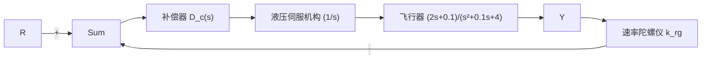
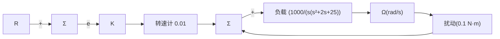

# 习题

10.1 在三种 PID 控制（比例、积分、微分）中，哪一种对于减小由不变干扰所引起的误差最有效果？请解释。  
10.2 对机械结构而言，当反馈控制系统中传感器不与执行器合体时，是不是具有很大的不稳定性？请解释。  
10.3 对于被控对象 $G(s)=1/s^{3}$ ，试问是否可以通过下面的超前补偿器使其稳定。

$$D _ {c} (s) = K \frac {s + a}{s + b}, \quad a < b$$

(a) 反馈系统的最大相位裕度是多少?  
(b) 包括此被控对象，和一定数量的超前补偿器的系统可以非条件稳定吗？请解释可以或不可以的原因。

10.4 考虑如图 10.88 所示的闭环系统。

(a) 当 K=70 000 系统的相位裕度是多少?  
(b) 当 K=70 000 系统的增益裕度是多少?  
(c) 系统产生 $70^{\circ}$ 相位裕度的 K 值是多少?  
(d) 系统产生 $0^{\circ}$ 相位裕度的 K 值是多少?

根轨迹、频率响应、状态反馈的极点配置以及对时域响应进行仿真在内的多种工具，从而获得一个良好的设计。在文章的开头，我们就希望读者能理解这些工具的使用方法，现在相信你已经可以实践控制工程的这门艺术。

(b) 波音 747 的俯仰控制。  
(c) CD 播放器的磁道跟踪控制。  
(d) 点火式汽车发动机的空燃比控制。  
(e) 给汽车喷漆的机械手臂的位置控制。  
(f) 轮船的航迹控制。  
(g) 直升机的姿态控制。

(e) 绘制系统以 K 为变量的根轨迹，并确定使系统处于临界稳定的 K 值。  
(f) 如果扰动量 w 为常量并且 K=10 000， $y(+\infty)<0.1$ ，此时 w 的最大值为多少？(假设 r=0)  
(g) 若要求得到比(f)问中 w 值更大的 w，但保持同样的误差限制条件 $\left|\left|y(+\infty)\right|<0.1\right|$ ，讨论用哪些步骤？

10.5 考虑如图 10.89 所示的系统代表某型号飞机的姿态变化率控制。

(a) 设计一个补偿器使其主导极点在 $-2 \pm 2j$ 处。  
(b) 绘制所设计系统的伯德图，选择补偿器，使其分隔频率最少为 $2\sqrt{2}$ rad/s 且 $PM \geqslant 50^{\circ}$ 。  
(c) 绘制所设计系统的根轨迹，并求出当 $\omega_{n}>2\sqrt{2}rad/s,\quad\zeta\geqslant0.5$ 时的速度常数。

10.6 如图 10.90 所示的伺服机构框图。下面这


<details>
<summary>flowchart</summary>

```mermaid
graph LR
    R["s"] -->|+| Sum1["Σ"]
    Sum1 -->|K(s+1)/s+100| Sum2["Σ"]
    Sum2 -->|1/(s(s+5)(s+10))| Y["s"]
    W["s"] -->|+| Sum2
    Sum2 -->|-| Sum1
```
</details>

图 10.88 习题 10.4 的控制系统


<details>
<summary>flowchart</summary>


</details>

图 10.89 飞行器姿态速率控制框图


<details>
<summary>flowchart</summary>


</details>

图10.90 习题10.6的伺服机构

些说法哪些是正确的？
