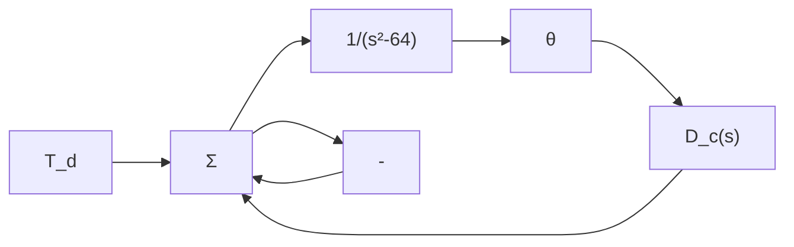

(a) 在评估稳定控制系统的最大有效增益时，必须包含执行器的动态性能分析（极点位于 1000rad/s）。  
(b) 稳定系统中增益 K 必须是负值。  
(c) 存在一个 K 值，使控制系统在频率为 4rad/s 和 6rad/s 之间振荡。  
(d) 如果 $\left|K\right|>10$ ，系统不稳定。  
(e) 若稳定时 K 为负值，控制系统不能抵消正干扰。  
(f) 正的不变干扰会增大负载，因而使 e 的终值为负。  
(g) 如果只有一个正的不变控制输入 r，误差信号 e 的终值必定大于零。  
(h) 当 K = -1 时闭环系统稳定，由扰动所引起的速度误差稳定幅值小于 5 rad/s。

10.7 图 10.91 所示的为平衡控制杆及其相应的控制框图。控制量是作用在支点上的力矩。

(a) 利用根轨迹分析方法，设计一个补偿器 $D(s)$ ，使得系统主导极点在 s = -5 ± 5j 处（相当于 $\omega_{n} = 7rad/s$ ， $\zeta = 0.707$ ）。  
(b) 利用伯德图法设计一个补偿器 $D(s)$ ，使其满足下列要求：

- 对于恒定的输入力矩 $T_{\mathrm{d}} = 1$ ，位移 $\theta$ 稳态值小于0.001。  
- 相位裕度 $\geqslant 50^{\circ}$ 。  
- 闭环带宽≈7rad/s。

flowchart

图 10.91 习题 10.7 的伺服机构

10.8 如图 10.92 所示的为标准的反馈系统图。

(a) 假设：

$$G (s) = \frac {2 5 0 0 K}{s (s + 2 5)}$$

设计一个超前补偿器使得系统的相位裕度大于 $45^{\circ}$ ；斜坡输入的稳态误差应

小于或等于0.01。

(b) 使用(a)问中的传递函数，设计一个超前补偿器使得系统的超调量小于25%，调整时间在允许误差为1%时小于0.1s。

(c) 假设：

$$G (s) = \frac {K}{s (1 + 0 . 1 s) (1 + 0 . 2 s)}$$

并让性能指标 $K_{v}=100,\ PM\geqslant40^{\circ}$ ，此时超前补偿对系统有影响吗？设计一个滞后补偿器，并绘制补偿后的系统根轨迹。

(d) 利用(c)问中的 $G(s)$ ，设计一个滞后补偿器使系统的峰值超调量小于 20%，并且 $K_{v}=100$ 。  
(e) 利用超前滞后补偿器，重复问题(c)问。  
(f) 求(e)问部分中补偿后的系统的根轨迹，并将其与(c)问部分中的根轨迹图进行比较。

10.9 考虑图 10.92 所示系统：

$$G (s) = \frac {3 0 0}{s (s + 0 . 2 2 5) (s + 4) (s + 1 8 0)}$$

设计补偿器 $D_{c}(s)$ 使得闭环系统满足下面的指标：

- 系统对阶跃输入是无差的。  
- $\mathrm{PM} = 55^{\circ}$ ， $\mathrm{GM}\geqslant 6\mathrm{dB}$   
● 增益穿越频率不小于未补偿的频率。

(a) 使用何种补偿器，为什么？

(b) 设计一个符合上述性能指标要求的补偿器 $D_{c}(s)$ 。

flowchart

图 10.92 标准反馈控制系统框图

10.10 我们已经讨论了三种设计方法：埃文斯根轨迹法，伯德频率响应法，状态变量极点配置法。解释下面关于这些方法的描述哪一个最好（如果你认为某种方法存在多个描述的话，请指出并说明理由）。

(a) 此方法在用获得的实验数据描述系统时是最常用的一种方法。

(b) 此方法为动态响应特性如上升时间、超调量及调整时间等提供最直接的控制。  
(c) 此方法更易于自动化(计算机)的实现。  
(d) 此方法为稳态误差常数 $K_{p}$ 和 $K_{v}$ 提供最直接的控制。  
(e) 此方法最可能使最简单的控制器符合动态和静态精度的要求。  
(f) 此方法能使设计者保证最终设计达到无条件稳定。  
(g) 此方法对于包含传递滞后项，比如 $G(s)=\frac{\mathrm{e}^{-2s}}{(s+3)^{2}}$ 的系统无须修正。
