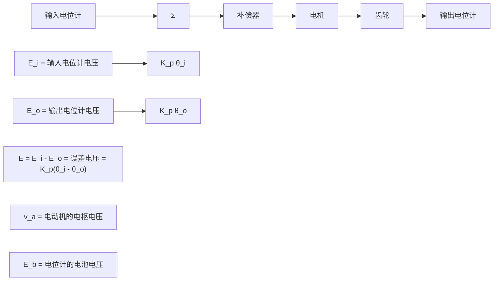

  
图 10.95 习题 10.14 的可选反馈结构

10.16 一架重282t的波音747飞机将要在海平面上着陆。在实例分析(10.3节)中所给出的状态并且假设飞机速度为221ft/s(0.198马赫)，则横向扰动方程为

$$
\begin{array}{l} \left[ \begin{array}{l} \dot {\beta} \\ \dot {r} \\ \dot {p} \\ \dot {\varphi} \end{array} \right] = \left[ \begin{array}{l l l l} - 0. 0 8 9 0 & - 0. 9 8 9 & 0. 1 4 7 8 & 0. 1 4 4 1 \\ 0. 1 6 8 & - 0. 2 1 7 & 0. 1 6 6 & 0 \\ - 1. 3 3 & 0. 3 2 7 & - 0. 9 7 5 & 0 \\ 0 & 0. 1 4 9 & 1 & 0 \end{array} \right] \left[ \begin{array}{l} \beta \\ r \\ p \\ \varphi \end{array} \right] \\ + \left[ \begin{array}{c} 0. 0 1 4 8 \\ - 0. 1 5 1 \\ 0. 0 6 3 6 \\ 0 \end{array} \right] \delta_ {\mathrm{r}} \\ \end{array}

y = \left[ \begin{array}{l l l l} 0 & 1 & 0 & 0 \end{array} \right] \left[ \begin{array}{l} \beta \\ r \\ p \\ \varphi \end{array} \right]
$$

相应的传递函数为

$$
\begin{array}{l} G (s) = \frac {r (s)}{\delta_ {\mathrm{r}} (s)} \\ = \frac {- 0 . 1 5 1 (s + 1 . 0 5) (s + 0 . 0 3 2 8 \pm 0 . 4 1 4 j)}{(s + 1 . 1 0 9) (s + 0 . 0 4 2 5) (s + 0 . 0 6 4 6 \pm 0 . 7 3 1 j)} \\ \end{array}
$$

(a) 绘制欠补偿系统的根轨迹[对 $1+KG(s)$ ]及系统的频率响应。系统可以选用哪种典型的控制器？

(b) 通过绘制系统的对称根轨迹，尝试对系统进行状态变量设计。就对称根轨迹而言，选择系统的闭环极点为

$$\alpha_ {c} (s) = (s + 1. 1 2) (s + 0. 1 6 5)(s + 0. 1 6 2 \pm 0. 6 8 1 \mathrm{j})$$

同时选择观测器极点使其比系统闭环极点快5倍，即

$$\alpha_ {e} (s) = (s + 5. 5 8) (s + 0. 8 2 5)(s + 0. 8 1 2 \pm 3. 4 0 j)$$

(c) 计算对称根轨迹补偿器的传递函数。

(d) 讨论系统对参数变化及非模型化动态的鲁棒性。

(e) 注意本设计与本章开始时为不同飞行条件而改进的设计之间的相似性。这对在整个操作过程中进行连续控制（非线性）有什么意义？

10.17 (L, Swindlehurst 教授提供) 图 10.96 所示的反馈控制系统是位置控制系统。由电枢控制的直流电动机是系统的一个重要组成部分。输入电位计产生电压 $E_{\mathrm{i}}$ ，该电压与轴的目标位置成比例关系，即 $E_{\mathrm{i}} = K_{\mathrm{p}} \theta_{\mathrm{i}}$ 。同样，输出电位计产生电压 $E_{0}$ ，该电压与轴的实际位置成比例关系，即 $E_{0} = K_{\mathrm{p}} \theta_{0}$ 。注意，这里我们假设两个电位计有相同的比例系数。利用误差信号 $E_{\mathrm{i}} - E_{0}$ 驱动补偿器，使其产生一个电枢电压来驱动电动机。电动机的电枢电阻为 $R_{\mathrm{a}}$ ，电枢电感为 $L_{\mathrm{a}}$ ，反电势常数为 $K_{\mathrm{e}}$ ，电动机轴的转动惯量为 $J_{\mathrm{m}}$ ，并且摩擦力产生的旋转阻尼为 $B_{\mathrm{m}}$ 。最后，齿轮齿数比为 $N:1$ ，负载的转动惯量为 $J_{\mathrm{L}}$ ，

flowchart

图 10.96 电动机轴上齿轮和电位计传感器上的伺服机构

负载的阻尼为 $B_{L}$
