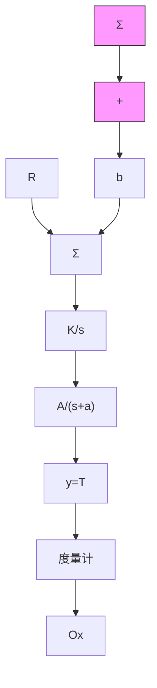

(a) 假定系统突然产生一个传感器误差，即 $b \neq 0$ ，其中 b 已知。尽管存在传感器误差，如何保证温度控制 R 的零稳态跟踪？  
(b) 这里假设 b=0 。在实际中，系统控制的是晶片表面的氧化膜 $(Ox)$ 的生长厚度，而不是温度。到目前为止，还没有能实时测量氧化膜生产厚度的传感器。所以半导体处理工程师必须利用一个脱机设备（称为度量器）来测量晶片表面氧化膜的生长厚度。系统的输出温度和氧化膜之间存在一个非线性的函数关系，即

氧化膜厚度 $= \int_{0}^{tf}p\mathrm{e}^{-\frac{c}{T(t)}}\mathrm{d}t$

其中：tf 为过程的持续时间；p 和 c 是已知的常数。试设计一个方案，通过温度控制器及其输出，将中心晶片表面氧化膜的厚度控制在理想值 $(Ox=5000\mathring{\mathrm{A}}(1\mathring{\mathrm{A}}=10^{-10}\mathrm{~m}))$ 。

10.22 设计一个卤钨灯的非线性模型，并在 Simulink 上仿真。  
10.23 设计一个高温计的非线性模型，说明如何从模型上推断出温度。  
10.24 将三个传感器组合在一起从而形成单个信号来控制平均温度，重复 RTP 实例中的设计。详述线性设计的性能，并在非线性 Simulink 仿真上验证性能。  
10.25 在光刻过程中，半导体晶片制造的步骤之一是在某一时间段将晶片放置在一个加热板上。通过实验数据给出了以加热源 u 为输入，晶片温度 y 为输出的传递函数为

$$\frac {y (s)}{u (s)} = G (s) = \frac {0 . 0 9}{(s + 0 . 1 9) (s + 0 . 7 8) (s + 0 . 0 0 0 1 8)}$$

(a) 绘制未补偿系统的 $180^{\circ}$ 根轨迹曲线。  
(b) 利用根轨迹的方法设计一个动态补偿器 $D_{c}(s)$ ，从而使系统满足下述的时域指标。

i) $M_{\mathrm{p}} \leqslant 5\%$   
ii) $t_{r} \leqslant 20s$ ;   
iii) $t_{s} \leqslant 60s;$

iv）对于 $1^{\circ}$ C 的阶跃输入信号，系统的稳态误差要 $<0.1^{\circ}$ C。

绘制此时补偿系统的 $180^{\circ}$ 根轨迹曲线。

10.26

系统生物学中的激励抑制模型(Yang and Iglesias, 2005): 在网柄菌属细胞中, 对化学引诱剂进行检测的关键信号分子的活性可通过下述的三阶线性模型来描述, 从外部干扰到输出的传递函数为

$$\frac {y (s)}{w (s)} = S (s) = \frac {(1 - \alpha) s}{(s + \alpha) (s + 1) (s + \gamma)}$$

其中：w 是与化学引诱剂浓度成比例的外部干扰信号；y 是活性调节的部分作为输出。下式是该系统的另一种传递函数的表述方式：

$$G (s) = \frac {(1 - \alpha)}{s ^ {2} + (1 + \alpha + \gamma) s + (\alpha + \gamma + \alpha \gamma)}$$

并且“反馈调节”为

$$D _ {c} (s) = \frac {\alpha \gamma}{(1 - \alpha) s}$$

我们知道在这个模型中 $\alpha\neq1$ 。绘制系统反馈框图并标示出系统的干扰输入的位置以及系统的输出。指出系统的这个特定的形式具有什么意义？系统所隐含的特性是否得到了显现？对本系统而言，干扰抑制了系统的鲁棒性吗？假设系统的参数值为 $\alpha=0.5,\gamma=0.2$ ，绘制在单位阶跃干扰输入下的系统的抗干扰响应曲线。

flowchart

图 10.98 RTP 系统
