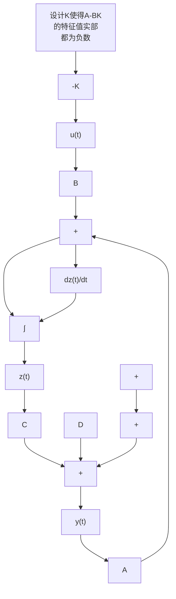

$$
\Rightarrow \lambda^ {2} + k _ {2} \lambda - \left(\frac {g}{d} - k _ {1}\right) = 0 \tag {10.3.9b}
$$

如果希望闭环状态矩阵的两个特征值为 $\lambda_{1,2} = -1 < 0$ (此时平衡点将变成稳定节点)，其对应的特征方程为

$$
(\lambda + 1) (\lambda + 1) = 0
$$

$$
\Rightarrow \lambda^ {2} + 2 \lambda + 1 = 0 \tag {10.3.10}
$$

对比式(10.3.9b)和式(10.3.10)，可得

$$
\left\{ \begin{array}{l} - \left(\frac {g}{d} - k _ {1}\right) = 1 \\ k _ {2} = 2 \end{array} \right.
$$

$$
\Rightarrow \left\{ \begin{array}{l} k _ {1} = 1 + \frac {g}{d} \\ k _ {2} = 2 \end{array} \right. \tag {10.3.11}
$$

代入式(10.3.7)，系统的输入为

$$
\boldsymbol {u} (t) = - \boldsymbol {K z} (t) = \left[ - k _ {1} - k _ {2} \right] \boldsymbol {z} (t) = \left[ - 1 - \frac {g}{d} - 2 \right] \boldsymbol {z} (t) \tag {10.3.12}
$$

将式(10.3.12)代入式(10.3.1)，可得

$$
\frac {\mathrm{d} \boldsymbol {z} (t)}{\mathrm{d} t} = \boldsymbol {A} _ {\mathrm{cl}} \boldsymbol {z} (t) = \left[ \begin{array}{c c} 0 & 1 \\ - 1 & - 2 \end{array} \right] \boldsymbol {z} (t) \tag {10.3.13}
$$

其反馈控制系统所对应的相轨迹如图10.3.2所示。在使用线性反馈控制 $\pmb {u}(t) = -\mathbf{K}\pmb {z}(t)$ 之后，原动态系统不稳定的平衡点变成了稳定的节点。

从本质上来说,这依然是比例控制,但相较于传统方法(只反馈位移信息),所有的状态信息(包括位移和速度)都被用作反馈,因此有两个比例增益 $k_{1}$ 和 $k_{2}$ 。第3章中曾经介绍过状态矩阵的特征值对应于传递函数的极点。所以这种设计思路也被称为极点配置(Pole Placement)。

text_image

z₂(t)
O
z₁(t)

图 10.3.2 线性状态反馈系统相轨迹分析

若将此案例推广到一般形式的状态空间方程中, 其设计框图如图 10.3.3 所示, 对比图 10.1.3, 可以发现它使用了全状态的反馈信息。设计核心是通过设计矩阵 K 使得闭环状态矩阵的特征值的实部部分都为负数。

flowchart

图 10.3.3 线性状态反馈控制器设计框图

在本例中, 式(10.3.10)中的特征值 $\lambda_{1,2} = -1$ 是随意选的, 只是选择了两个负数来保证系统的稳定性。在实际应用中, 是否可以通过某种方式指导设计这个值的选择将是 10.3.2 节讨论的重点。

线性状态反馈控制器一极点配置内容请扫描此二维码观看。
