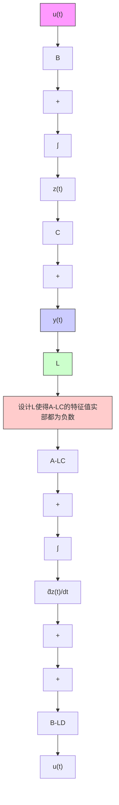

# 10.4.3 线性观测器举例

本节将通过一个实例说明观测器的设计与工作原理。如图 10.4.2 所示的弹簧振动阻尼系统，其中 $m=1\mathrm{kg}, k=1\mathrm{N}/\mathrm{m}, b=0.5\mathrm{Ns}/\mathrm{m}$ 。系统输出是位移 $y(t)=x(t)$ ，输入是外力 $u(t)=f(t)$ 。

flowchart

图 10.4.1 线性观测器设计框图

text_image

k
x(t)
m
f(t)=u(t)
b

图 10.4.2 弹簧振动阻尼系统 态空间方程,为

选择系统状态变量,令 $z_{1}(t)=x(t)$ , 代表位移, $z_{2}(t)=\frac{\mathrm{d}z_{1}(t)}{\mathrm{d}t}=\frac{\mathrm{d}x(t)}{\mathrm{d}t}$ , 代表速度。在第 3 章中曾经推导出它的状

$$
\frac {\mathrm{d}}{\mathrm{d} t} \left[ \begin{array}{l} z _ {1} (t) \\ z _ {2} (t) \end{array} \right] = \left[ \begin{array}{c c} 0 & 1 \\ - \frac {k}{m} & - \frac {b}{m} \end{array} \right] \left[ \begin{array}{l} z _ {1} (t) \\ z _ {2} (t) \end{array} \right] + \left[ \begin{array}{l} 0 \\ \frac {1}{m} \end{array} \right] u (t) \tag {10.4.9a}
$$

$$
y (t) = \left[ \begin{array}{l l} 1 & 0 \end{array} \right] \left[ \begin{array}{l} z _ {1} (t) \\ z _ {2} (t) \end{array} \right] + [ 0 ] [ u (t) ] \tag {10.4.9b}
$$

将 $m=1kg, k=1N/m, b=0.5Ns/m$ 代入式(10.4.9)，可得

$$
\frac {\mathrm{d}}{\mathrm{d} t} \left[ \begin{array}{l} z _ {1} (t) \\ z _ {2} (t) \end{array} \right] = \mathbf {A} \left[ \begin{array}{l} z _ {1} (t) \\ z _ {2} (t) \end{array} \right] + \mathbf {B u} (t) \tag {10.4.9c}
$$

$$
y (t) = \mathbf {C} \left[ \begin{array}{l} z _ {1} (t) \\ z _ {2} (t) \end{array} \right] + \mathbf {D u} (t) \tag {10.4.9d}
$$

其中， $A=\begin{bmatrix}0&1\\ -1&-0.5\end{bmatrix},B=\begin{bmatrix}0\\ 1\end{bmatrix},C=\begin{bmatrix}1&0\end{bmatrix},D=\begin{bmatrix}0\end{bmatrix}.$

假设在此系统中可以使用一个传感器实时测量质量块的位移, 即系统的输出 $y(t)$ , 同时也是状态变量之一 $z_{1}(t)$ 。但是无法测量另一个状态变量 $z_{2}(t)$ , 即质量块的速度。因此需要使用观测器来估计 $z_{2}(t)$ , 令
