当矩阵 $\begin{bmatrix}(A-LC) & 0 \\ BK & (A-BK)\end{bmatrix}$ 特征值的实部都为负数时， $\begin{bmatrix}\tilde{z}(t) \\ z(t)\end{bmatrix}$ 将趋于平衡点 $\begin{bmatrix}0 \\ 0\end{bmatrix}$ 。矩阵 $\begin{bmatrix}(A-LC) & 0 \\ BK & (A-BK)\end{bmatrix}$ 是三角矩阵，因此其特征值就是对角线上两个矩阵 $(A-LC)$ 和 $(A-BK)$ 的特征值。这被称为分离原理 (Separation Principle)。在设计过程中可以分别设计 L 和 K，并将估计值 $\hat{z}(t)$ 用在 $u(t) = -K\hat{z}(t)$ 中。需要特别注意的是，在选取 $(A-LC)$ 和 $(A-BK)$ 的特征值时，观测器的收敛速度应该快于控制器的收敛速度（一般要求快 2～5 倍）。因为只有这样才能保证控制器的设计是基于一个相对准确的估计值之上的。观测器与控制器结合后的系统设计框图如图 10.4.4 所示，实际上是将图 10.3.2 和图 10.4.1 结合起来。同时，读者也可以推导带有前馈的控制器与观测器的结合。读者可以自行完成剩余的工作，设计含有观测器的指尖平衡控制系统。

```mermaid
graph TD
    A["设计K使得A-BK的特征值实部都为负数"] --> B["-K"]
    B --> C["u(t)"]
    C --> D["B"]
    D --> E["+"]
    E --> F["∫"]
    F --> G["z(t)"]
    G --> H["C"]
    H --> I["+"]
    I --> J["y(t)"]
    J --> K["L"]
    K --> L["设计L使得A-LC的特征值实部都为负数"]
    L --> M["A"]
    M --> N["+"]
    N --> O["∫"]
    O --> P["ẑ(t)"]
    P --> Q["+"]
    Q --> R["A-LC"]
    R --> S["+"]
    S --> T["B-LD"]
    T --> U["+"]
    U --> V["∫"]
    V --> W["z(t)"]
    W --> X["C"]
    X --> Y["+"]
    Y --> Z["y(t)"]
    Z --> AA["L"]
    AA --> AB["+"]
    AB --> AC["∫"]
    AC --> AD["ẑ(t)"]
    AD --> AE["A-LC"]
    AE --> AF["+"]
    AF --> AG["B-LD"]
    AG --> AH["+"]
    AH --> AI["∫"]
    AI --> AJ["z(t)"]
    AJ --> AK["C"]
    AK --> AL["+"]
    AL --> AM["y(t)"]
    AM --> AN["L"]
    AN --> AO["+"]
    AO --> AP["∫"]
    AP --> AQ["ẑ(t)"]
    AQ --> AR["A-LC"]
    AR --> AS["+"]
    AS --> AT["B-LD"]
    AT --> AU["+"]
    AU --> AV["∫"]
    AV --> AW["z(t)"]
    AW --> AX["C"]
    AX --> AY["+"]
    AY --> AZ["y(t)"]
```

flowchart

图 10.4.4 线性观测器与控制器结合设计框图
