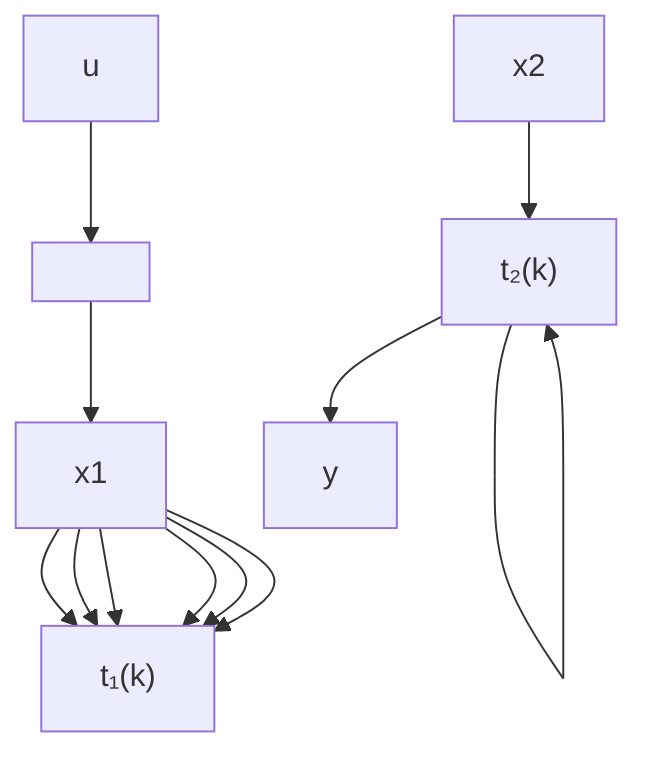

# 11.3 用极大代数方法建模

离散事件动态系统 (DEDS) 的第一个重要问题是建模。建模有多种方法，用极大代数方法建模的优点是可以建成与传统线性系统理论的 $(A, B, C)$ 模型相对应的模型，只不过这里不是传统的域上的线性系统，而是极大代数这种特殊的没有减法的代数结构上的线性系统。DEDS 本身是极为复杂的非线性系统，因而 Cohen 等人[17] 把极大代数的建模方法称为伪线性方法。本节介绍 Cohen 等人提出的从 Petri 网出发，用极大代数建模的方法。本节内容主要引自文献[10], [17]等。

Petri 网有很强的建模与仿真能力，也为许多工程师所熟悉。但 Petri 网模型在变迁数目大时分析起来较困难，不如极大代数方法。下面叙述用 Petri 网建模与变 Petri 网模型为极大代数模型的方法。

首先介绍一类 Petri 网的基础知识.

Petri 网是 Petri 博士在 1962 年的博士论文中提出与创立的。经过他与众多研究者几十年的工作，已发展成一整套理论，包含了各种类型的 Petri 网。我们使用的 Petri 网是其中的一种，全名称为时间事件图 (Timed Event Graph)，简称事件图。这类 Petri 网也由位置与变迁构成，但规定每个位置的前后只有一个变迁，位置内的参数表示标识在位置中停留的时间。图 11.3.1 所示是一个事件图的例子，图中有两个状态变迁 $x_1, x_2$ 。一个输入变迁 $u$ 。一个输出变迁 $y$ ，圆圈表示位置，圆圈中的“”表示初始标识， $t_i(k)$ 都表示一个标识在位置中停留的时间。系统的运行原理如下：

(1) 只要一个变迁前面每个位置中都至少存在一个标识，它就可以激发；  
(2) 一个变迁每激发一次，它前面的每个位置中都有一个标识被吸收，而它后面的每个位置中都增加一个标识，输入变迁每次只输入一个标识，输出变迁每次只输出一个标识；  
(3) 一个变迁可以连续多次激发.

事件图的扩展与推广是扩展时间事件图 (Extended Timed Event Graph), 也称为事件重图 (Event Multi-graph), 文献 [1] 介绍了它. 它与事件图仅有一点不同: 变迁前后的弧上标有参数 $v$ 与 $u$ , 运行原理是: 当一个变迁前面每个位置中都至少存在 $v$ 个标识时它就激发; 每激发一次, 它前面的每个位置中都有 $v$ 个标识被吸收,而它后面的每个位置中都增加 $u$ 个标识。扩展时间事件图有更强的建模与描述能力，特别地，它可以用来描述带包装工序的生产线，各台机器加工批量不同的生产线等。11.9节将介绍这类系统的双子代数方法。

flowchart

图11.3.1 事件图的例子

串行生产线是一类特殊的制造系统。两台机器构成的串行生产线可描述于下：系统有两台机器 $m_{1}$ 和 $m_{2}$ ，每个工件都是先在 $m_{1}$ 上加工，再在 $m_{2}$ 上加工，并且两台机器加工工件的顺序是一样的，都是先加工 $P_{1}$ ，再加工 $P_{2}, \cdots$ ，假设 $m_{1}$ 和 $m_{2}$ 加工第 k 个工件的开始时刻分别为 $x_{1}(k), x_{2}(k)$ ，加工时间分别为 $t_{1}(k), t_{2}(k)$ ，第 k 个工件输入到 $m_{1}$ 的时刻为 $u(k)$ ，离开 $m_{2}$ 的时刻为 $y(k)$ ，则此系统可以用 Petri 网建模，即可用一个事件图描述，如图 11.3.1 所示。按事件图的运行原理，可得系统的极大代数方程为

$$x _ {1} (k) = t _ {1} (k - 1) x _ {1} (k - 1) \oplus u (k), \tag {11.3.1}x _ {2} (k) = t _ {1} (k) x _ {1} (k) \oplus t _ {2} (k - 1) x _ {2} (k - 1), \tag {11.3.2}y (k) = t _ {2} (k) x _ {2} (k). \tag {11.3.3}$$

把式 (11.3.1) 代入式 (11.3.2) 得到

$$x _ {2} (k) = t _ {1} (k - 1) t _ {1} (k) x _ {1} (k - 1) \oplus t _ {2} (k - 1) x _ {2} (k - 1) \oplus t _ {1} (k) u (k). \tag {11.3.4}$$

令 $X(k) = [x_{1}(k)x_{2}(k)]$ ，则式(11.3.1)与式(11.3.4)合起来可以写成如下形式：
