```mermaid
graph TD
    A[" "] --> B[" "]
    B --> C[" "]
    C --> D[" "]
    D --> E[" "]
    E --> F[" "]
    F --> G[" "]
    G --> H[" "]
    H --> I[" "]
    I --> J[" "]
    J --> K[" "]
    K --> L[" "]
    L --> M[" "]
    M --> N[" "]
    N --> O[" "]
    O --> P[" "]
    P --> Q[" "]
    Q --> R[" "]
    R --> S[" "]
    S --> T[" "]
    T --> U[" "]
    U --> V[" "]
    V --> W[" "]
    W --> X[" "]
    X --> Y[" "]
    Y --> Z[" "]
    Z --> AA[" "]
    AA --> AB[" "]
    AB --> AC[" "]
    AC --> AD[" "]
    AD --> AE[" "]
    AE --> AF[" "]
    AF --> AG[" "]
    AG --> AH[" "]
    AH --> AI[" "]
    AI --> AJ[" "]
    AJ --> AK[" "]
    AK --> AL[" "]
    AL --> AM[" "]
    AM --> AN[" "]
    AN --> AO[" "]
    AO --> AP[" "]
    AP --> AQ[" "]
    AQ --> AR[" "]
    AR --> AS[" "]
    AS --> AT[" "]
    AT --> AU[" "]
    AU --> AV[" "]
    AV --> AW[" "]
    AW --> AX[" "]
    AX --> AY[" "]
    style A fill:#f9f,stroke:#333
    style B fill:#ccf,stroke:#333
    style C fill:#cfc,stroke:#333
    style D fill:#cfc,stroke:#333
    style E fill:#cfc,stroke:#333
    style F fill:#cfc,stroke:#333
    style G fill:#cfc,stroke:#333
    style H fill:#cfc,stroke:#333
    style I fill:#cfc,stroke:#333
    style J fill:#cfc,stroke:#333
    style K fill:#cfc,stroke:#333
    style L fill:#cfc,stroke:#333
    style M fill:#cfc,stroke:#333
    style N fill:#cfc,stroke:#333
    style O fill:#cfc,stroke:#333
    style P fill:#cfc,stroke:#333
    style Q fill:#cfc,stroke:#333
    style R fill:#cfc,stroke:#333
    style S fill:#cfc,stroke:#333
    style T fill:#cfc,stroke:#333
    style U fill:#cfc,stroke:#333
    style V fill:#cfc,stroke:#333
    style W fill:#cfc,stroke:#333
    style X fill:#cfc,stroke:#333
    style Y fill:#cfc,stroke:#333
    style Z fill:#cfc,stroke:#333
    style AA fill:#cfc,stroke:#333
    style AB fill:#cfc,stroke:#333
    style AC fill:#cfc,stroke:#333
    style AD fill:#cfc,stroke:#333
    style AE fill:#cfc,stroke:#333
    style AF fill:#cfc,stroke:#333
    style AG fill:#cfc,stroke:#333
    style AH fill:#cfc,stroke:#333
    style AI fill:#cfc,stroke:#333
    style AJ fill:#cfc,stroke:#333
    style AK fill:#cfc,stroke:#333
    style AL fill:#cfc,stroke:#333
    style AM fill:#cfc,stroke:#333
    style AN fill:#cfc,stroke:#333
    style AO fill:#cfc,stroke:#333
    style AP fill:#cfc,stroke:#333
    style AQ fill:#cfc,stroke:#333
    style AR fill:#cfc,stroke:#333
```

图 11.9.1 热轧生产线的 ETEG 模型

现在，可用ETEG对例11.9.1进行建模，如图11.9.1所示。注意到 $W$ 表示弧的重数，这也是ETEG被称为事件重图的原因；我们只画出一条弧，而在弧上标出重数。变迁前的重数记为 $\pmb{v}$ ，表示只有变迁前的位置中有 $\pmb{v}$ 个标识（每条弧分到一个），才能激发，变迁吸收 $\pmb{v}$ 个标识激发一次后，通过变迁的 $\pmb{u}$ 条弧（重数记为 $\pmb{u}$ ）在变迁后的位置中增加 $\pmb{u}$ 个标识（每条弧产生一个）。
