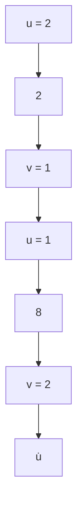

# 习题 11.9

11.9.1 完成定理 11.9.1 的证明.

11.9.2 设系统的ETEG模型如下：

flowchart

```mermaid
graph TD
    A["u = 2"] --> B["2"]
    B --> C["v = 1"]
    C --> D["u = 1"]
    D --> E["8"]
    E --> F["v = 2"]
    F --> G["u̇"]
```

求系统的双子代数模型.
