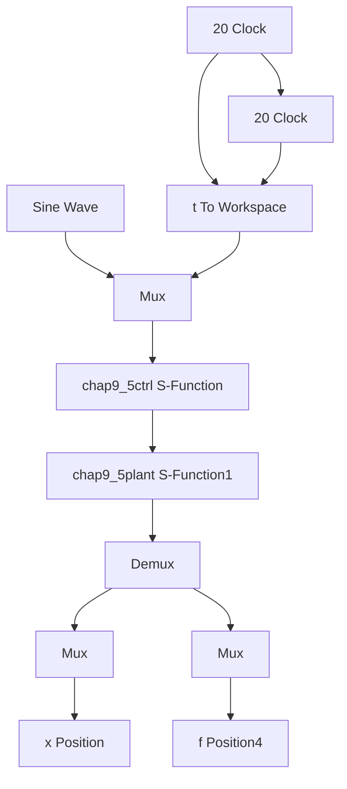

# 一种简单的 RBF 网络自适应控制仿真程序

(1) Simulink 主程序: chap9\_5sim.mdl


<details>
<summary>flowchart</summary>


</details>

(2) 控制律及自适应律 S 函数: chap9\_5ctrl.m

```txt
function [sys,x0,str,ts]=spacemodel(t,x,u,flag)
switch flag,
case 0,
[sys,x0,str,ts]=mdlInitializeSizes; 
```

```matlab
case 1,
    sys=mdlDerivatives(t,x,u);
case 3,
    sys=mdlOutputs(t,x,u);
case {2,4,9}
    sys=[];
otherwise
    error(['Unhandled flag=',num2str(flag)]);
end
function [sys,x0,str,ts]=mdlInitializeSizes
global b c lama
sizes=simsizes;
sizes.NumContStates=5;
sizes.NumDiscStates=0;
sizes.NumOutputs=2;
sizes.NumInputs=4;
sizes.DirFeedthrough=1;
sizes.NumSampleTimes=1;
sys=simsizes(sizes);
x0=0.1*ones(1,5);
str=[];
ts=[0 0];
c=0.5*[-2-1 0 1 2;
    -2-1 0 1 2];
b=3.0;
lama=10;
function sys=mdlDerivatives(t,x,u)
global b c lama
xd=sin(t);
dxd=cos(t);

x1=u(2);
x2=u(3);
e=x1-xd;
de=x2-dxd;
s=lama*e+de;

W=[x(1)x(2)x(3)x(4)x(5)]';
xi=[x1;x2];

h=zeros(5,1);
for j=1:1:5
    h(j)=exp(-norm(xi-c(:,j))^2/(2*b^2));
end 
```

```matlab
gama=1500;
for i=1:1:5
    sys(i)=gama*s*h(i);
end

function sys=mdlOutputs(t,x,u)
global b c lama
xd=sin(t);
dxd=cos(t);
ddxd=-sin(t);

x1=u(2);
x2=u(3);
e=x1-xd;
de=x2-dxd;
s=lama*e+de;

W=[x(1)x(2)x(3)x(4)x(5)];
xi=[x1;x2];

h=zeros(5,1);
for j=1:1:5
    h(j)=exp(-norm(xi-c(:,j))^2/(2*b^2));
end
fn=W*h;
xite=1.50;

% fn=10*x1+x2; % Precise f
ut=-lama*de+ddxd-fn-xite*sign(s);

sys(1)=ut;
sys(2)=fn; 
```

(3) 被控对象 S 函数: chap9\_5plant.m  
```matlab
function [sys,x0,str,ts]=s_function(t,x,u,flag)
switch flag,
case 0,
    [sys,x0,str,ts]=mdlInitializeSizes;
case 1,
    sys=mdlDerivatives(t,x,u);
case 3,
    sys=mdlOutputs(t,x,u);
case {2,4,9}
    sys=[];
otherwise 
```

```matlab
error(['Unhandled flag=',num2str(flag)]);
end
function [sys,x0,str,ts]=mdlInitializeSizes
sizes=simsizes;
sizes.NumContStates=2;
sizes.NumDiscStates=0;
sizes.NumOutputs=3;
sizes.NumInputs=2;
sizes.DirFeedthrough=0;
sizes.NumSampleTimes=0;
sys=simsizes(sizes);
x0=[0.15;0];
str=[];
ts=[];
function sys=mdlDerivatives(t,x,u)
ut=u(1);

f=10*x(1)*x(2);
sys(1)=x(2);
sys(2)=f+ut;
function sys=mdlOutputs(t,x,u)
f=10*x(1)*x(2);

sys(1)=x(1);
sys(2)=x(2);
sys(3)=f; 
```
