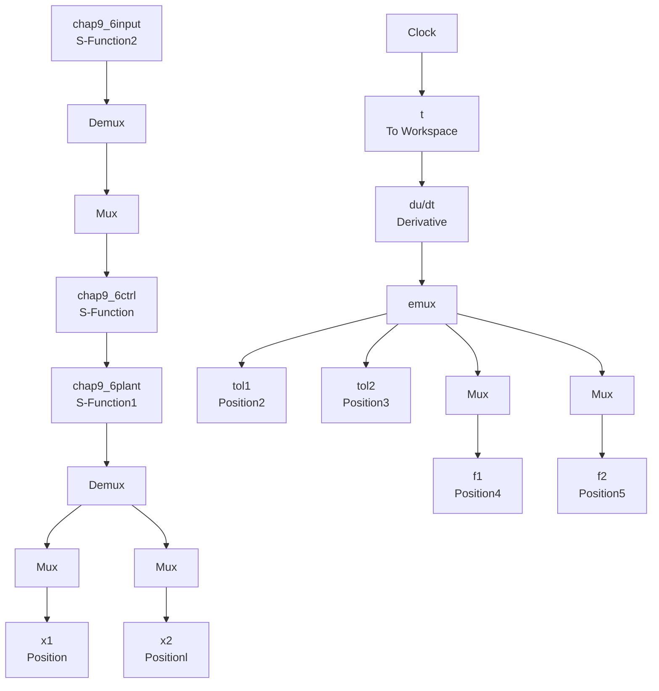

# 基于不确定逼近的 RBF 网络自适应控制仿真实例程序

(1) Simulink 主程序: chap9\_6sim.mdl


<details>
<summary>flowchart</summary>


</details>

(2) 位置指令子程序: chap9\_6input.m

function [sys,x0,str,ts] = spacemodel(t,x,u,flag)   
```matlab
switch flag,
case 0,
    [sys,x0,str,ts]=mdlInitializeSizes;
case 1,
    sys=mdlDerivatives(t,x,u);
case 3,
    sys=mdlOutputs(t,x,u);
case {2,4,9}
    sys=[];
otherwise
    error(['Unhandled flag = ',num2str(flag)]);
end

function [sys,x0,str,ts]=mdlInitializeSizes
sizes=simsizes;
sizes.NumContStates =0;
sizes.NumDiscStates =0;
sizes.NumOutputs =2;
sizes.NumInputs =0;
sizes.DirFeedthrough =0;
sizes.NumSampleTimes =1; 
```

```matlab
sys = simsizes(sizes);
x0 = [];
str = [];
ts = [0 0];
function sys=mdlOutputs(t,x,u)
qd1=1+0.2*sin(0.5*pi*t);
qd2=1-0.2*cos(0.5*pi*t);
sys(1)=qd1;
sys(2)=qd2; 
```

(3) 控制器子程序: chap9\_6ctrl.m  
```txt
function [sys,x0,str,ts] = spacemodel(t,x,u,flag) 
```

```matlab
switch flag,
case 0,
    [sys,x0,str,ts]=mdlInitializeSizes;
case 1,
sys=mdlDerivatives(t,x,u);
case 3,
sys=mdlOutputs(t,x,u);
case {2,4,9}
sys=[];
otherwise
error(['Unhandled flag = ',num2str(flag)]);
end

function [sys,x0,str,ts]=mdlInitializeSizes
global c b kvkp
sizes=simsizes;
sizes.NumContStates=10;
sizes.NumDiscStates=0;
sizes.NumOutputs=6;
sizes.NumInputs=8;
sizes.DirFeedthrough=1;
sizes.NumSampleTimes=1;
sys=simsizes(sizes);
x0=0.1*ones(1,10);
str=[];
ts=[0 0];

% c=0.60*ones(4,5);
c=[-2 -1 0 1 2;
-2 -1 0 1 2;
-2 -1 0 1 2;
-2 -1 0 1 2]; 
```

```matlab
b=3.0*ones(5,1);
alfa=3;
kp=[alfa^2 0;
    0 alfa^2];
kv=[2*alfa 0;
    0 2*alfa];
function sys=mdlDerivatives(t,x,u)
global c b kvkp

A=[zeros(2) eye(2);
    -kp -kv];
B=[0 0;0 0;1 0;0 1];

Q=[50 0 0 0;
    0 50 0 0;
    0 0 50 0;
    0 0 0 50];
P=lyap(A',Q);
eig(P);
