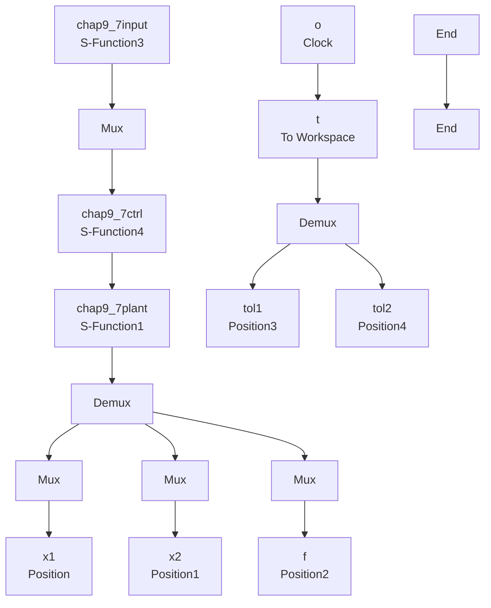

# 基于模型整体逼近的机器人 RBF 网络自适应控制仿真实例程序

(1) Simulink 主程序: chap9\_7sim.mdl


<details>
<summary>flowchart</summary>


</details>

(2) 位置指令子程序: chap9\_7input.m

function [sys,x0,str,ts] = spacemodel(t,x,u,flag)   
```matlab
switch flag,
case 0,
    [sys,x0,str,ts]=mdlInitializeSizes;
case 1,
    sys=mdlDerivatives(t,x,u);
case 3,
    sys=mdlOutputs(t,x,u);
case {2,4,9}
    sys=[];
otherwise
    error(['Unhandled flag = ',num2str(flag)]);
end
function [sys,x0,str,ts]=mdlInitializeSizes
sizes=simsizes;
sizes.NumContStates =0;
sizes.NumDiscStates =0;
sizes.NumOutputs =6;
sizes.NumInputs =0;
sizes.DirFeedthrough =0;
sizes.NumSampleTimes =1;
sys=simsizes(sizes);
x0 = [];
str = [];
ts = [0 0]; 
```

```matlab
function sys=mdlOutputs(t,x,u)
qd1=0.1*sin(t);
d_qd1=0.1*cos(t);
dd_qd1=-0.1*sin(t);
qd2=0.1*sin(t);
d_qd2=0.1*cos(t);
dd_qd2=-0.1*sin(t);

sys(1)=qd1;
sys(2)=d_qd1;
sys(3)=dd_qd1;
sys(4)=qd2;
sys(5)=d_qd2;
sys(6)=dd_qd2; 
```

(3) 针对 $f(x)$ 进行逼近的控制器子程序: chap9\_7ctrl.m  
```matlab
function [sys,x0,str,ts] = spacemodel(t,x,u,fla
switch flag,
case 0,
    [sys,x0,str,ts]=mdlInitializeSizes;
case 1,
    sys=mdlDerivatives(t,x,u);
case 3,
    sys=mdlOutputs(t,x,u);
case {2,4,9}
    sys=[];
otherwise
    error(['Unhandled flag = ',num2str(flag)]);
end

function [sys,x0,str,ts]=mdlInitializeSizes
global node c b Fai
node=7;
c=0.1* [-1.5 -1 -0.5 0 0.5 1 1.5;
    -1.5 -1 -0.5 0 0.5 1 1.5;
    -1.5 -1 -0.5 0 0.5 1 1.5;
    -1.5 -1 -0.5 0 0.5 1 1.5];
b=10;
Fai=5*eye(2);

sizes = simsizes;
sizes.NumContStates = 2*node;
sizes.NumDiscStates = 0;
sizes.NumOutputs = 3;
sizes.NumInputs = 11;
sizes.DirFeedthrough = 1;
sizes.NumSampleTimes = 0;
sys = simsizes(sizes);
x0 = 0.1*ones(1,2*node);
str = []; 
```

```matlab
ts = [];
function sys=mdlDerivatives(t,x,u)
global node c b Fai
qd1=u(1);
d_qd1=u(2);
dd_qd1=u(3);
qd2=u(4);
d_qd2=u(5);
dd_qd2=u(6);
