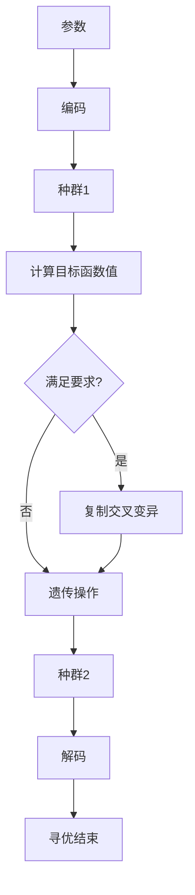

# 10.4.2 遗传算法的应用步骤

对于一个需要进行优化的实际问题,一般可按下述步骤构造遗传算法。

第 1 步: 确定决策变量及各种约束条件, 即确定出个体表现型 X 和问题的解空间;  
第 2 步: 建立优化模型, 即确定出目标函数的类型及数学描述形式或量化方法;  
第 3 步: 确定表示可行解的染色体编码方法, 即确定出个体基因型 x 及遗传算法的搜索空间;  
第 4 步: 确定个体适应度的量化评价方法, 即确定出由目标函数值 $J(x)$ 到个体适应度函数 $F(x)$ 的转换规则;

第 5 步: 设计遗传算子, 即确定选择运算、交叉运算、变异运算等遗传算子的具体操作方法;

第 6 步: 确定遗传算法的有关运行参数, 即 $M, G, P_{c}, P_{m}$ 等参数;

第 7 步: 确定解码方法, 即确定出由个体表现型 X 到个体基因型 x 的对应关系或转换方法。

以上操作过程可以用图 10-1 来表示。

flowchart

图 10-1 遗传算法流程图
