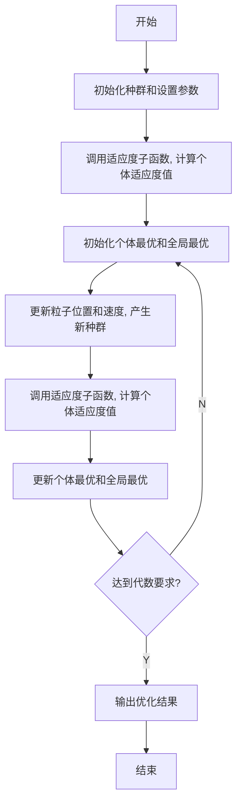

# 10.7.3 粒子群算法的基本流程

(1) 初始化: 设定参数运动范围, 设定学习因子 $c_{1}, c_{2}$ , 最大进化代数 $G, kg$ 表示当前的进化代数。在一个 $D$ 维参数的搜索解空间中, 粒子组成的种群规模大小为 Size, 每个粒子代表解空间的一个候选解, 其中第 $i (1 \leqslant i \leqslant \text{Size})$ 个粒子在整个解空间的位置表示为 $X_{i}$ , 速度表示为 $V_{i}$ 。第 $i$ 个粒子从初始到当前迭代次数搜索产生的最优解为个体极值 $p_{i}$ , 整个种群目前的最优解为 BestS。随机产生 Size 个粒子, 随机产生初始种群的位置矩阵和速度矩阵。  
(2) 个体评价(适应度评价): 将各个粒子初始位置作为个体极值, 计算群体中各个粒子的初始适应值 $f(X_{i})$ , 并求出种群最优位置。  
（3）更新粒子的速度和位置，产生新种群，并对粒子的速度和位置进行越界检查。为避免算法陷入局部最优解，加入一个局部自适应变异算子进行调整。

$$V _ {i} ^ {k g + 1} = w (t) \times V _ {i} ^ {k g} + c _ {1} r _ {1} \left(p _ {i} ^ {k g} - X _ {i} ^ {k g}\right) + c _ {2} r _ {2} \left(\text {BestS} _ {i} ^ {k g} - X _ {i} ^ {k g}\right) \tag {10.7}X _ {i} ^ {k g + 1} = X _ {i} ^ {k g} + V _ {i} ^ {k g + 1} \tag {10.8}$$

其中， $kg = 1,2,\cdots,G,i = 1,2,\cdots$ ，Size， $r_{1}$ 和 $r_{2}$ 为 0 到 1 的随机数， $c_{1}$ 为局部学习因子， $c_{2}$ 为全局学习因子，一般取 $c_{2}$ 大一些。

（4）比较粒子的当前适应值 $f(X_{i})$ 和自身历史最优值 $p_{i}$ 。如果 $f(X_{i})$ 优于 $p_{i}$ ，则置 $p_{i}$ 为当前值 $f(X_{i})$ ，并更新粒子位置。  
（5）比较粒子当前适应值 $f(X_{i})$ 与种群最优值 BestS。如果 $f(X_{i})$ 优于 BestS，则置 BestS 为当前值 $f(X_{i})$ ，更新种群全局最优值。  
(6) 检查结束条件, 若满足, 则结束寻优; 否则 $kg = kg + 1$ , 转至(3)。结束条件为寻优达到最大进化代数, 或评价值小于给定精度。

PSO 算法的流程图如图 10-7 所示。

flowchart

图 10-7 PSO 的算法流程图
