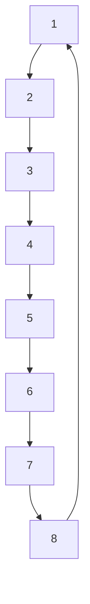

# 10.8.1 基于粒子群算法的函数优化

利用粒子群算法求 Rosenbrock 函数的极大值

$$
\left\{ \begin{array}{l} f (x _ {1}, x _ {2}) = 1 0 0 (x _ {1} ^ {2} - x _ {2}) ^ {2} + (1 - x _ {1}) ^ {2} \\ - 2. 0 4 8 \leqslant x _ {i} \leqslant 2. 0 4 8 \quad (i = 1, 2) \end{array} \right.
$$

该函数有两个局部极大点,分别是 $f(2.048,-2.048)=3897.7342$ 和 $f(-2.048,-2.048)=3905.9262$ ,其中后者为全局最大点。

全局粒子群算法中,粒子i的邻域随着迭代次数的增加而逐渐增加,开始第一次迭代,它的邻域粒子的个数为0。随着迭代次数的增加,邻域线性变大,最后邻域扩展到整个粒子群。全局粒子群算法收敛速度快,但容易陷入局部最优。而局部粒子群算法收敛速度慢,但可有效避免局部最优。

全局粒子群算法中,每个粒子的速度的更新是根据粒子自己历史最优值 $p_{i}$ 和粒子群体全局最优值 $p_{g}$ 进行的。为了避免陷入局部极小,可采用局部粒子群算法,每个粒子速度更新根据粒子自己历史最优值 $p_{i}$ 和粒子邻域内粒子的最优值 $p_{local}$ 进行。

根据取邻域的方式的不同,局部粒子群算法有很多不同的实现方法。本节采用最简单的环形邻域法,如图 10-8 所示。

flowchart

图10-8 环形邻域法

以8个粒子为例说明局部粒子群算法,如图10-8所示。在每次进行速度 图10-8 环形邻域法和位置更新时,粒子1追踪1、2、8这3个粒子中的最优个体,粒子2追踪1、2、3这3个粒子中的最优个体,依此类推。仿真中,求解某个粒子邻域中的最优个体是由函数 chap10\_3lbest.m 来完成的。

在局部粒子群算法中,按如下两式更新粒子的速度和位置

$$V _ {i} ^ {k g + 1} = w (t) \times V _ {i} ^ {k g} + c _ {1} r _ {1} \left(p _ {i} ^ {k g} - X _ {i} ^ {k g}\right) + c _ {2} r _ {2} \left(p _ {\text {local}} ^ {k g} - X _ {i} ^ {k g}\right) \tag {10.9}X _ {i} ^ {k g + 1} = X _ {i} ^ {k g} + V _ {i} ^ {k g + 1} \tag {10.10}$$

式中， $p_{ilocal}^{kg}$ 为局部寻优的粒子。

同样,对粒子的速度和位置要进行越界检查。为避免算法陷入局部最优解,加入一个局部自适应变异算子进行调整。

采用实数编码求函数极大值,用两个实数分别表示两个决策变量 $x_{1}, x_{2}$ , 分别将 $x_{1}, x_{2}$ 的定义域离散化为从离散点 -2.048 到离散点 2.048 的 Size 个实数。个体的适应度直接取为对应的目标函数值, 越大越好, 即取适应度函数为 $F(x) = f(x_{1}, x_{2})$ 。

在粒子群算法仿真中，取粒子群个数为 $\mathrm{Size} = 50$ ，最大迭代次数 $G = 100$ ，粒子运动最大速度为 $V_{\mathrm{max}} = 1.0$ ，即速度范围为[-1,1]。学习因子取 $c_{1} = 1.3, c_{2} = 1.7$ ，采用线性递减的惯性权重，惯性权重采用从0.90线性递减到0.10的策略。

根据 M 的不同可采用不同的粒子群算法。取 M = 2，采用局部粒子群算法。按式(10.9)和式(10.10)更新粒子的速度和位置，产生新种群。经过 100 步迭代，最佳样本为 BestS = [-2.048 - 2.048]，即当 $x_{1} = -2.048, x_{2} = -2.048$ 时，Rosenbrock 函数具有极大值，极大值为 3905.9。

适应度函数 F 的变化过程如图 10-9 所示。由仿真可见，随着迭代过程的进行，粒子群通过追踪自身极值和局部极值，不断更新自身的速度和位置，从而找到全局最优解。通过采用局部粒子群算法，增强了算法的局部搜索能力，有效地避免了陷入局部最优解，仿真结果表明正确率在 95% 以上。

line

| generations | Fitness function |
| --- | --- |
| 0 | 3200 |
| 5 | 3900 |
| 100 | 3900 |

图10-9 适应度函数 $F$ 的优化过程
