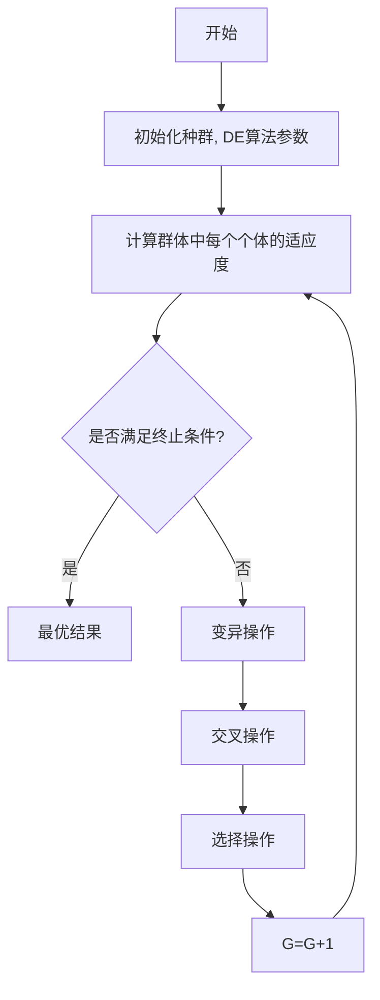

# (4) 选择操作

为了确定 $x_{i}(t)$ 是否成为下一代的成员，试验向量 $v_{i}(t + 1)$ 和目标向量 $x_{i}(t)$ 对评价函数进行比较：

$$
x _ {i} (t + 1) = \left\{ \begin{array}{l l} v _ {i} (t + 1), f (v _ {i 1} (t + 1), \dots , v _ {i n} (t + 1)) > f (x _ {i 1} (t), \dots , x _ {i n} (t)) \\ x _ {i j} (t), \quad f (v _ {i 1} (t + 1), \dots , v _ {i n} (t + 1)) \leqslant f (x _ {i 1} (t), \dots , x _ {i n} (t)) \end{array} \right. \tag {10.17}
$$

反复执行步骤(2)至步骤(4)操作,直至达到最大的进化代数G,差分进化基本运算流程如图10-11所示。

flowchart

图 10-11 差分进化基本运算流程
