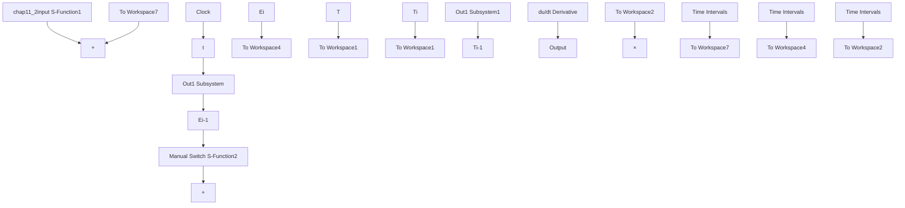

# (1) 主程序: chap11\_2main.m

```matlab
% Iterative D-Type Learning Control
clear all;
close all;

t=[0:0.01:1]';
k(1:101)=0; % Total initial points
k=k'; 
```

```matlab
T1(1:101)=0;
T1=T1';
T2=T1;
T=[T1 T2];

k1(1:101)=0; % Total initial points
k1=k1';
E1(1:101)=0;
E1=E1';
E2=E1;
E3=E1;
E4=E1;
E=[E1 E2 E3 E4];
%%%%
M=30;
for i=0:1:M % Start Learning Control
i
pause(0.01);

sim('chap11_2sim',[0,1]);

x1=x(:,1);
x2=x(:,2);

x1d=xd(:,1);
x2d=xd(:,2);
dx1d=xd(:,3);
dx2d=xd(:,4);

e1=E(:,1);
e2=E(:,2);
de1=E(:,3);
de2=E(:,4);
e=[e1 e2]';
de=[de1 de2]';

figure(1);
subplot(211);
hold on;
plot(t,x1,'b',t,x1d,'r');
xlabel('time(s)');ylabel('x1d,x1');

subplot(212);
hold on;
plot(t,x2,'b',t,x2d,'r');
xlabel('time(s)');ylabel('x2d,x2');

j=i+1;
times(j)=i;
eli(j)=max(abs(e1));
e2i(j)=max(abs(e2)); 
```

```matlab
deli (j)=max(abs(de1));
de2i (j)=max(abs(de2));
end % End of i
figure(2);
subplot(211);
plot(t,x1d,'r',t,x1,'b');
xlabel('time(s)');ylabel('Position tracking of x1');
subplot(212);
plot(t,x2d,'r',t,x2,'b');
xlabel('time(s)');ylabel('Position tracking of x2'); 
```

```matlab
figure(3);
subplot(211);
plot(t,T(:,1),'r');
xlabel('time(s)');ylabel('Control input 1');
subplot(212);
plot(t,T(:,2),'r');
xlabel('time(s)');ylabel('Control input 2'); 
```

```matlab
figure(4);
plot(times,eli,'*-r',times,e2i,'o-b');
title('Change of maximum absolute value of error1 and error2 with times');
xlabel('time(s)');ylabel('error 1 and error 2'); 
```

(2) Simulink 程序: chap11\_2sim.mdl


<details>
<summary>flowchart</summary>


</details>

(3) 被控对象子程序: chap11\_2plant.m
