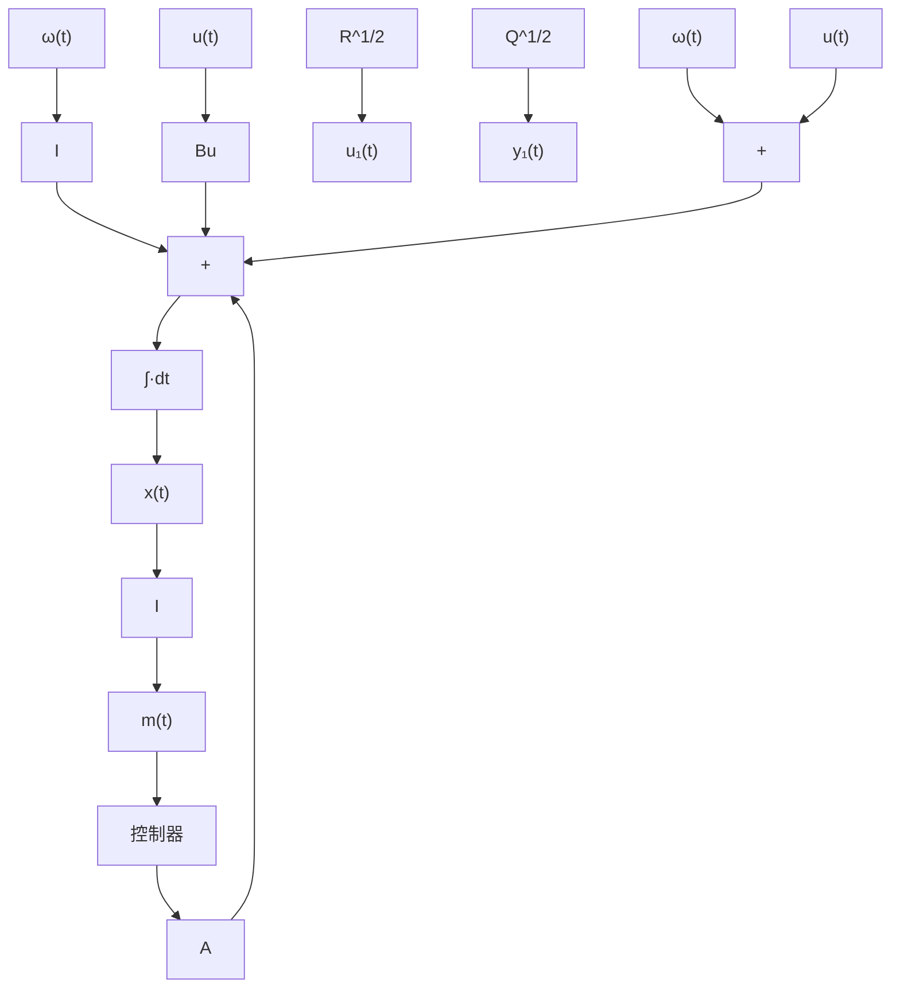

# 11.2.1 LQR 问题与 $H_{2}$ 最优控制问题

一个反馈系统的性能可以用从扰动输入到参考输出之间的闭环增益来衡量。系统的2-范数代表一个平均增益，可被用来作为一个最优控制问题的代价函数。当被控对象被近似给定以后，关于LQR的最优控制问题也就是使闭环系统的2-范数取最小值的最优问题。把LQR问题明确地叙述为一个系统的2-范数最优化问题可以从另一个角度考察LQR问题，并且可以比较容易得到公式来描述系统的频域特性。

$H_{2}$ 最优控制问题将为下面的被控对象找到线性时不变控制器

$$
\dot {\boldsymbol {x}} (t) = \boldsymbol {A} \boldsymbol {x} (t) + \left[ \begin{array}{l l} \boldsymbol {B} _ {\boldsymbol {u}} & \boldsymbol {I} \end{array} \right] \left[ \begin{array}{l} \boldsymbol {u} (t) \\ \boldsymbol {\omega} (t) \end{array} \right]

\left[ \begin{array}{l} \boldsymbol {m} (t) \\ \boldsymbol {y} _ {1} (t) \\ \boldsymbol {u} _ {1} (t) \end{array} \right] = \left[ \begin{array}{l} 1 \\ Q ^ {\frac {1}{2}} \\ 0 \end{array} \right] \boldsymbol {x} (t) + \left[ \begin{array}{c c} \boldsymbol {0} & \boldsymbol {0} \\ \boldsymbol {0} & \boldsymbol {0} \\ R ^ {\frac {1}{2}} & \boldsymbol {0} \end{array} \right] \left[ \begin{array}{l} \boldsymbol {u} (t) \\ \boldsymbol {\omega} (t) \end{array} \right]
$$

使得由被控对象组成的闭环系统稳定，并且使得系统的2-范数最小。

$$J _ {2} = \left[ \int_ {0} ^ {\infty} t r \left\{\boldsymbol {g} _ {\mathrm{cl}} ^ {\mathrm{T}} (t) \boldsymbol {g} _ {\mathrm{cl}} (t) \right\} \mathrm{d} t \right] ^ {\frac {1}{2}} = \| \boldsymbol {G} _ {\mathrm{cl}} \| _ {2}$$

式中 $g_{\mathrm{el}}(t)$ 是从扰动输入到参考输出之间的闭环系统的脉冲响应矩阵。上面所示系统的结构图将在图 11-1 中给出。符号 $H_{2}$ 源自全局稳定线性时不变系统的 hardy 空间 (H)，下标 2 代表所应用的系统范数。

$H_{2}$ 最优控制问题等价于稳态随机调节器。在这个情况下，最优反馈增益是时不变的，并使系统稳定。 $H_{2}$ 最优控制问题和稳态随机调节器的等价性可以通过稳态参考输出的均方值来得出。

$$
E \left\{\left[ \mathbf {y} _ {1} ^ {\mathrm{T}} (\infty) \mathbf {u} _ {1} ^ {\mathrm{T}} (\infty) \right] \left[ \begin{array}{l} \mathbf {y} _ {1} (\infty) \\ \mathbf {u} _ {1} (\infty) \end{array} \right] \right\} = E \left[ \mathbf {x} ^ {\mathrm{T}} (\infty) \mathbf {Q x} (\infty) + \right.
\boldsymbol {u} ^ {\mathrm{T}} (\infty) \boldsymbol {R u} (\infty) ]
$$

上式就等于稳态随机调节器的指标函数。这个输出的均方值也能通

flowchart

图11-1 $H_{2}$ 最优控制方框图

过闭环系统的 2 - 范数来得到。

$$
E \left\{\left[ \begin{array}{l l} \mathbf {y} _ {1} ^ {\mathrm{T}} (\infty) & \mathbf {u} _ {1} ^ {\mathrm{T}} (\infty) \end{array} \right] \left[ \begin{array}{l} \mathbf {y} _ {1} (\infty) \\ \mathbf {u} _ {1} (\infty) \end{array} \right] \right\} = \| \mathbf {G} _ {\mathrm{el}} \| _ {2} ^ {2}
$$

通过这两个表达式,随机调节器的指标函数可以看作系统2-范数的平方:

$$J _ {\mathrm{SR}} = J _ {2} ^ {2}$$

假设谱密度矩阵是单位阵。由于平方运算是单调的，使 $J_{SR}$ 最小的控制也使 $J_{2}$ 取最小。这样， $H_{2}$ 最优反馈控制就等于状态反馈控制，在这里，反馈增益是稳态随机调节器增益，或者等价为稳态LQR增益。

带有 LQR 反馈增益的状态反馈能使 $H_{2}$ 指标取最小。这些额外的结果使得 LQR 解在一个比较宽阔的控制应用领域中变得非常有用。
