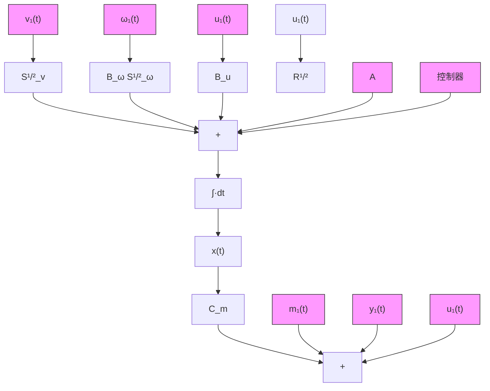

# 11.2.2 LQG 问题与 $H_{2}$ 最优控制问题

稳态线性二次型高斯最优控制问题等价于一个 $H_{2}$ 最优控制问题。这个 $H_{2}$ 最优控制问题按如下的方式给出：

给出具有标称干扰输入和参考输出的被控对象：

$$
\dot {\boldsymbol {x}} (t) = \boldsymbol {A} \boldsymbol {x} (t) + \left[ \begin{array}{l l l} \boldsymbol {B} _ {u} & \boldsymbol {B} _ {\omega} \boldsymbol {S} _ {\omega} ^ {\frac {1}{2}} & \mathbf {0} \end{array} \right] \left[ \begin{array}{l} \boldsymbol {u} (t) \\ \boldsymbol {\omega} _ {1} (t) \\ \boldsymbol {v} _ {1} (t) \end{array} \right]
$$

flowchart

图11-2 把LQG问题作为一个 $H_{2}$ 最优控制问题

$$
\left[ \begin{array}{l} \boldsymbol {m} (t) \\ \boldsymbol {y} _ {1} (t) \\ \boldsymbol {u} _ {1} (t) \end{array} \right] = \left[ \begin{array}{l} \boldsymbol {C} _ {m} \\ \boldsymbol {Q} ^ {\frac {1}{2}} \\ \boldsymbol {0} \end{array} \right] \boldsymbol {x} (t) + \left[ \begin{array}{c c c} \boldsymbol {0} & \boldsymbol {0} & S _ {v} ^ {\frac {1}{2}} \\ \boldsymbol {0} & \boldsymbol {0} & \boldsymbol {0} \\ R ^ {\frac {1}{2}} & \boldsymbol {0} & \boldsymbol {0} \end{array} \right] \left[ \begin{array}{l} \boldsymbol {u} (t) \\ \boldsymbol {\omega} _ {1} (t) \\ \boldsymbol {v} _ {1} (t) \end{array} \right]
$$

找到一个反馈控制器,能够使闭环系统内稳定而且使闭环系统2-范数取最小值:

$$J _ {2} = \left\| \boldsymbol {G} _ {\mathrm{cl}} \right\| _ {2}$$

为了表现出这种等价性,LQG 代价函数能用闭环系统 2-范数的形式写出:
