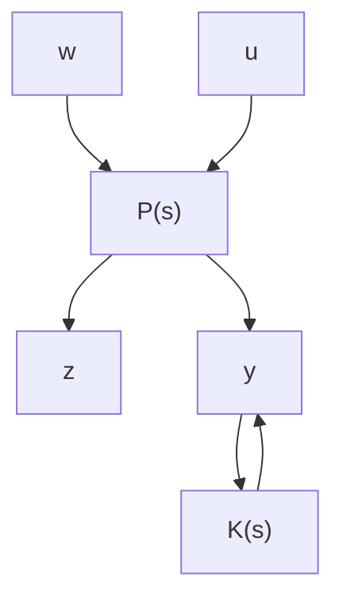

# 11.3.2 $H_{\infty}$ 标准问题

在基于 $H_{\infty}$ 控制理论的控制系统设计中，无论是鲁棒稳定还是干扰抑制问题，都可以转化为求反馈控制器使闭环系统稳定且闭环传递函数阵的 $H_{\infty}$ 范数最小或小于某一给定值。这种同一模式下的 $H_{\infty}$ 优化问题，即称之为 $H_{\infty}$ 标准问题。下面就来介绍这种目前应用最广泛的 $H_{\infty}$ 标准问题。

设线性定常系统如图 11-3 所示。其中， $z \in R^{m}$ 表示输出信号，是应设计需要而定义的评价信号, $w\in R^{p}$ 表示外部干扰输入信号,包括干扰、噪声、参考输入等,是为了设计而定义的辅助信号, $u\in R^{r}$ 是控制输入信号, $y\in R^{q}$ 是测量信号, $P(s)$ 表示广义被控对象,包括实际被控对象和为了描述设计指标而设定的加权函数, $K(s)$ 表示所设计的控制器。

flowchart

图11-3 $H_{\infty}$ 标准控制问题

广义被控对象 $P(s)$ 的状态方程描述为

$$\dot {\boldsymbol {x}} = \boldsymbol {A} \boldsymbol {x} + \boldsymbol {B} _ {1} \boldsymbol {w} + \boldsymbol {B} _ {2} \boldsymbol {u}\boldsymbol {z} = \boldsymbol {C} _ {1} \boldsymbol {x} + \boldsymbol {D} _ {1 1} \boldsymbol {w} + \boldsymbol {D} _ {1 2} \boldsymbol {u} \tag {11-1}\mathbf {y} = \mathbf {C} _ {2} \mathbf {x} + \mathbf {D} _ {2 1} \mathbf {w} + \mathbf {D} _ {2 2} \mathbf {u}$$

其中 $x \in R^n$ 表示状态向量, 传递函数的形式为

$$
\boldsymbol {P} (s) = \left[ \begin{array}{l l} \boldsymbol {P} _ {1 1} & \boldsymbol {P} _ {1 2} \\ \boldsymbol {P} _ {2 1} & \boldsymbol {P} _ {2 2} \end{array} \right] = \left[ \begin{array}{l l} \boldsymbol {D} _ {1 1} & \boldsymbol {D} _ {1 2} \\ \boldsymbol {D} _ {2 1} & \boldsymbol {D} _ {2 2} \end{array} \right] + \left[ \begin{array}{l} \boldsymbol {C} _ {1} \\ \boldsymbol {C} _ {2} \end{array} \right] (s \boldsymbol {I} - \boldsymbol {A}) ^ {- 1} [ \boldsymbol {B} _ {1} - \boldsymbol {B} _ {2} ]

= \left[ \begin{array}{l l l} \boldsymbol {A} & \boldsymbol {B} _ {1} & \boldsymbol {B} _ {2} \\ \boldsymbol {C} _ {1} & \boldsymbol {D} _ {1 1} & \boldsymbol {D} _ {1 2} \\ \boldsymbol {C} _ {2} & \boldsymbol {D} _ {2 1} & \boldsymbol {D} _ {2 2} \end{array} \right] = \left[ \begin{array}{l l} \boldsymbol {A} & \boldsymbol {B} \\ \boldsymbol {C} & \boldsymbol {D} \end{array} \right] \tag {11-2}
$$

输入输出描述为

$$
\left[ \begin{array}{l} z \\ y \end{array} \right] = P \left[ \begin{array}{l} w \\ u \end{array} \right] = \left[ \begin{array}{l l} P _ {1 1} & P _ {1 2} \\ P _ {2 1} & P _ {2 2} \end{array} \right] \left[ \begin{array}{l} w \\ u \end{array} \right] \tag {11-3}
$$

控制器表述为

$$\boldsymbol {u} = \boldsymbol {K y} \tag {11-4}$$
