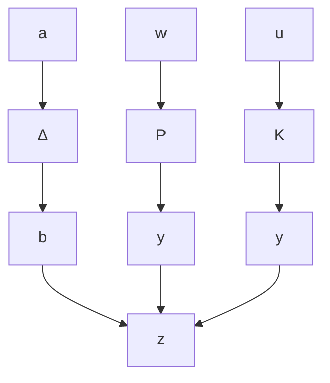

# 1. 鲁棒稳定性问题

对于 $H_{\infty}$ 标准问题, 基本框图如图 11-3 所示。但当被控对象 $P(s)$

含有不确定性因素时,通过抽取不确定性部分 $\Delta$ 后,闭环系统有如图 11-4 所示结构。

$$
\left[ \begin{array}{l} \boldsymbol {b} \\ z \\ y \end{array} \right] = \boldsymbol {P} \left[ \begin{array}{l} \boldsymbol {a} \\ w \\ u \end{array} \right] \tag {11-8}
$$

flowchart

图11-4 不确定性系统的 $H_{\infty}$ 控制

$$
\boldsymbol {P} = \left[ \begin{array}{l l l} \boldsymbol {P} _ {1 1} & \boldsymbol {P} _ {1 2} & \boldsymbol {P} _ {1 3} \\ \boldsymbol {P} _ {2 1} & \boldsymbol {P} _ {2 2} & \boldsymbol {P} _ {2 3} \\ \boldsymbol {P} _ {3 1} & \boldsymbol {P} _ {3 2} & \boldsymbol {P} _ {3 3} \end{array} \right] \tag {11-9}
\boldsymbol {a} = \boldsymbol {\Delta b} \tag {11-10}\boldsymbol {u} = \boldsymbol {K y} \tag {11-11}
$$

(1) 考虑含加性不确定性, 系统框图如图 11-5(a) 所示, 有

$$
\begin{array}{l} \boldsymbol {w} = \boldsymbol {d} \\ z = y = d + W a + G u \\ \boldsymbol {b} = \boldsymbol {u} \\ \end{array}
$$

与图11-4对应,则有

$$
\boldsymbol {P} = \left[ \begin{array}{c c c} \boldsymbol {0} & \boldsymbol {0} & \boldsymbol {I} \\ \boldsymbol {W} & \boldsymbol {I} & \boldsymbol {G} \\ \boldsymbol {W} & \boldsymbol {I} & \boldsymbol {G} \end{array} \right]
$$

图11-5 含各类不确定性和扰动的系统框图

(2) 考虑乘性不确定性, 如图 11-5(b) 所示, 有

$$
\begin{array}{l} \boldsymbol {w} = \boldsymbol {d} \\ z = y = d + W a + G u \\ \boldsymbol {b} = \boldsymbol {G u} \\ \end{array}
$$

与图 11-4 对应, 则有

$$
\boldsymbol {P} = \left[ \begin{array}{c c c} \boldsymbol {0} & \boldsymbol {0} & \boldsymbol {G} \\ \boldsymbol {W} & \boldsymbol {I} & \boldsymbol {G} \\ \boldsymbol {W} & \boldsymbol {I} & \boldsymbol {G} \end{array} \right]
$$

(3) 考虑互质分解描述不确定性, 系统框图如图 11-5(c) 所示, 有

$$\boldsymbol {w} = \boldsymbol {d}z = y = d + M _ {1} ^ {- 1} W a + N _ {1} M _ {1} ^ {- 1} u\boldsymbol {b} _ {1} = \boldsymbol {M} _ {1} ^ {- 1} \boldsymbol {W} \boldsymbol {a} + \boldsymbol {N} _ {1} \boldsymbol {M} _ {1} ^ {- 1} \boldsymbol {u} = \boldsymbol {M} _ {1} ^ {- 1} \boldsymbol {W} \boldsymbol {a} + \boldsymbol {G} \boldsymbol {u}\boldsymbol {b} _ {2} = \boldsymbol {u}$$

与图11-4对应,则有
