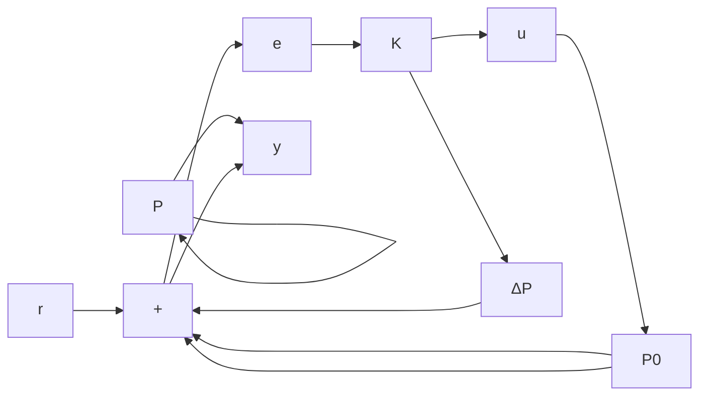

$$
\boldsymbol {P} = \left[ \begin{array}{c c c} \boldsymbol {M} _ {1} ^ {- 1} \boldsymbol {W} & \boldsymbol {0} & \boldsymbol {G} \\ \boldsymbol {0} & \boldsymbol {0} & \boldsymbol {I} \\ \boldsymbol {M} _ {1} ^ {- 1} \boldsymbol {W} & \boldsymbol {I} & \boldsymbol {G} \end{array} \right]
$$

综上所述,图 11-5 所述的各类不确定性系统的控制问题可以用图 11-4 所示的方式统一描述,从而转换成一般鲁棒控制问题。

结合式(11-8)\~式(11-10)，有

$$
\left[ \begin{array}{l} z \\ y \end{array} \right] = P _ {\Delta} \left[ \begin{array}{l} w \\ u \end{array} \right] \tag {11-12}

\boldsymbol {P} _ {\Delta} = \left[ \begin{array}{l l} \boldsymbol {P} _ {\Delta 1 1} & \boldsymbol {P} _ {\Delta 1 2} \\ \boldsymbol {P} _ {\Delta 2 1} & \boldsymbol {P} _ {\Delta 2 2} \end{array} \right] = \left[ \begin{array}{l l} \boldsymbol {P} _ {2 2} & \boldsymbol {P} _ {2 3} \\ \boldsymbol {P} _ {3 2} & \boldsymbol {P} _ {3 3} \end{array} \right] + \left[ \begin{array}{l} \boldsymbol {P} _ {2 1} \\ \boldsymbol {P} _ {3 1} \end{array} \right] \boldsymbol {\Delta} (\boldsymbol {I} - \boldsymbol {P} _ {1 1} \boldsymbol {\Delta}) ^ {- 1} [ \boldsymbol {P} _ {1 2} - \boldsymbol {P} _ {1 3} ] \tag {11-13}
$$

将式 $(11-11)$ 代入式 $(11-12)$ ，得

$$z = T _ {\Delta z w} w$$

其中，

$$\boldsymbol {T} _ {\Delta z w} = \boldsymbol {P} _ {\Delta 1 1} + \boldsymbol {P} _ {\Delta 1 2} \boldsymbol {K} (\boldsymbol {I} - \boldsymbol {P} _ {\Delta 2 2} \boldsymbol {K}) ^ {- 1} \boldsymbol {P} _ {\Delta 2 1} = \boldsymbol {F} _ {1} (\boldsymbol {P} _ {\Delta}, \boldsymbol {K})$$

$P_{\Delta ij}(i,j=1,2)$ 由式(11-13)给出。 $\Delta\in RH_{\infty},\|\Delta\|_{\infty}\leqslant1$

不确定性系统的鲁棒稳定性问题,就是寻找反馈控制器 K,使得图 11-4 所示的闭环系统在任意有界稳定摄动 $\Delta$ 的作用下内稳定,且满足

$$\| \boldsymbol {F} _ {1} (\boldsymbol {P} _ {\Delta}, \boldsymbol {K}) \| _ {\infty} < \gamma \tag {11-14}$$

其中 $\gamma > 0$ 是一给定常数。

下面举例说明这种鲁棒稳定设计问题可以通过设定 $H_{\infty}$ 性能指标而实现。

设有如下一个人造卫星姿态控制的地面试验装置,该装置由于其太阳能电池板的柔韧性,无法将其作为刚体处理。对于该被控对象,设计如图11-6所示的反馈控制系统,进行卫星姿态控制。被控对象的数学模型为

$$\boldsymbol {P} (s) = \boldsymbol {P} _ {0} (s) + \Delta \boldsymbol {P} (s)$$

flowchart

图11-6 鲁棒控制系统

其中， $\Delta P(s)$ 是由于被控对象的柔性特性而产生的高频振动项。

在进行系统设计的时候,采用简化的数学模型 $P_{0}(s)$ , 模型误差即为 $\Delta P(s)$ , 假设 $\Delta P(s)$ 的频率特性上界已知, 即
