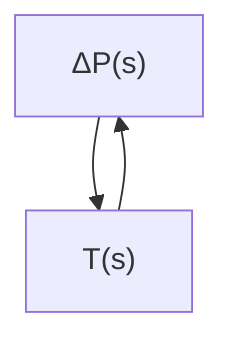
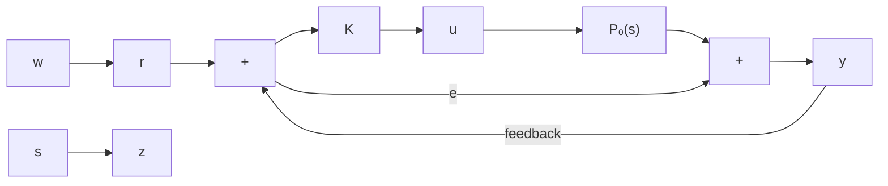

$$\left| \Delta P (\mathrm{j} w) \right| < \left| W (\mathrm{j} w) \right| \quad \forall w \in [ 0, + \infty ]$$

其中， $W(jw)$ 为已知的有理函数。

对于上述卫星姿态控制系统,如果只考虑对于简化模型 $P_{0}(s)$ 的系统稳定性,那么由于摄动项 $\Delta P(s)$ 的影响,实际系统将会出现溢振现象,无法抑制卫星太阳能电池板在移动过程中出现的振动现象。因此,基于鲁棒稳定性的控制律设计,应该在设计的时候就考虑模型误差,这对工程实际具有很重要的意义。

上面的系统可以等价地表示为图11-7：

其中， $\boldsymbol{T}(s) = \frac{\boldsymbol{K}(s)}{1 + \boldsymbol{P}_{0}(s)\boldsymbol{K}(s)}$

如果 $T(s)$ 是稳定的(即在 s 右半平面解析), 那么根据 Nyquist 稳定判据可知, 闭环系统对任意 $\Delta P(s)$ 稳定的充分条件是

$$\left| \Delta P (\mathrm{j} w) W (\mathrm{j} w) \right| < 1 \quad \forall w \in [ 0, + \infty ]$$

flowchart

图11-7 等价系统

即开环系统的 Nyquist 曲线位于单位圆内, 不围绕 -1 点。

因此,如果设计控制器 $K(s)$ 使得 $T(s)$ , 等价于原系统 $\Delta P(s)=0$ 的标称系统稳定, 同时满足 $\|T(s)W(s)\|_{\infty}<1$ , 则系统鲁棒稳定。

所以，上述卫星姿态控制问题就可以描述为，对于标称模型 $P_0(s)$ 和 $\pmb{W}(s)$ ，设计如图11-8所示的反馈控制器 $\pmb{K}(s)$ ，使得闭环系统稳定，同时满足 $H_{\infty}$ 性能指标 $\| T_{zw}(s) \|_{\infty} < 1$ ，其中 $T_{zw}(s)$ 表示由 $w$ 至 $z$ 的闭环传递函数。

flowchart

图11-8 鲁棒稳定控制器设计

与鲁棒稳定性问题相对应的还有鲁棒性能问题。
