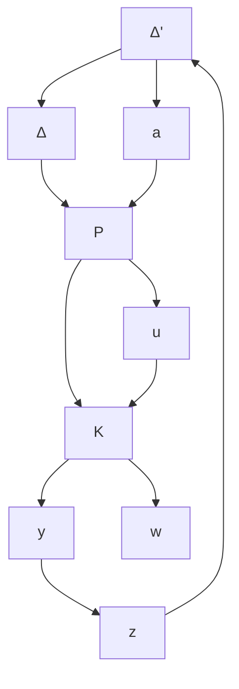
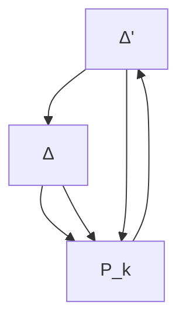

# 2. 鲁棒性能问题

对于鲁棒性能问题可以归结为一类特殊的鲁棒稳定性问题。

令对任意有界稳定摄动 $\Delta$ ，存在满足式(11-14)的控制器 K，由式(11-8)\~式(11-11)可得闭环控制系统为

$$
\left[ \begin{array}{l} \boldsymbol {b} \\ z \end{array} \right] = \boldsymbol {P} _ {k} \left[ \begin{array}{l} \boldsymbol {a} \\ w \end{array} \right] \tag {11-15}
$$

其中，

$$
\boldsymbol {P} _ {k} = \left[ \begin{array}{l l} \boldsymbol {P} _ {k 1 1} & \boldsymbol {P} _ {k 1 2} \\ \boldsymbol {P} _ {k 2 1} & \boldsymbol {P} _ {k 2 2} \end{array} \right] = \left[ \begin{array}{l l} \boldsymbol {P} _ {1 1} & \boldsymbol {P} _ {1 2} \\ \boldsymbol {P} _ {2 1} & \boldsymbol {P} _ {2 2} \end{array} \right] + \left[ \begin{array}{l} \boldsymbol {P} _ {1 3} \\ \boldsymbol {P} _ {2 3} \end{array} \right] \boldsymbol {K} (\boldsymbol {I} - \boldsymbol {P} _ {3 3} \boldsymbol {K}) ^ {- 1} [ \boldsymbol {P} _ {3 1} - \boldsymbol {P} _ {3 2} ] \tag {11-16}
$$

此时,式(11-14)意味着图 11-6 所示闭环系统由 w 到 z 的传递关系对任意有界稳定摄动 $\Delta$ 都是稳定的。

在不确定系统鲁棒稳定性分析中,依据小增益定理,鲁棒性能问题可归结于选择控制器 K,使闭环系统对 w 和 z 两端的任意有界稳定摄动 $\Delta'$ 都稳定。如图 11-9(a) 所示。

结合不确定性 $\Delta$ 和有界稳定摄动 $\Delta'$ ，则系统的鲁棒性能问题最终归结于选择控制器 K，使该闭环系统对任意的 $\Delta$ 和 $\Delta'$ 皆稳定。

如图 11-9(b) 所示, 将 $\Delta$ 和 $\Delta'$ 合并, 则有

flowchart

(a) 鲁棒性能问题

flowchart

(b) 鲁棒性能问题的等价结构  
图11-9

$$
\boldsymbol {\Delta} _ {s} = \left[ \begin{array}{l l} \boldsymbol {\Delta} & \mathbf {0} \\ \mathbf {0} & \boldsymbol {\Delta} ^ {\prime} \end{array} \right] \tag {11-17}
$$

根据小增益理论,选取

$$\| \boldsymbol {P} _ {k} \| _ {\infty} < \gamma \tag {11-18}$$

其中 $\gamma > 0$ 是一给定常数。则图 11-9 所示系统是内稳定的。
