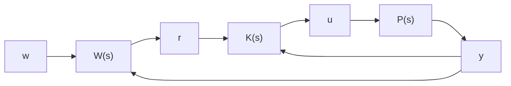

# 3. 二自由度控制系统问题。

flowchart

图11-10 二自由度控制系统框图

一般二自由度控制系统的结构图如图11-10所示。二自由度控制系统的特点是：通过将参考输入直接前馈到控制输入端来加快信号跟踪响应。图中 $\pmb{w}$ 为干扰信号， $\pmb{r}$ 为参考输入信号， $\pmb{y}$ 为输出信号，且 $\pmb{r},\pmb{y}$ 可量测， $\pmb{w}$ 为干扰信号， $\pmb{P}(s)$ 为被控对象， $\pmb{K}(s)$ 为二自由度控制器， $\pmb{u}$ 为控制输入，且满足 $\pmb{u} = \pmb{K}(s)\begin{bmatrix} \pmb{r}\\ \pmb{y} \end{bmatrix}$ 。

现在的控制目的是尽量减小系统的跟踪误差,试通过合理的选择输入输出变量,将二自由度控制系统转化为 $H_{\infty}$ 标准问题,使得系统可通过求解 $H_{\infty}$ 标准问题得到理想的控制器 $K(s)$ 。
