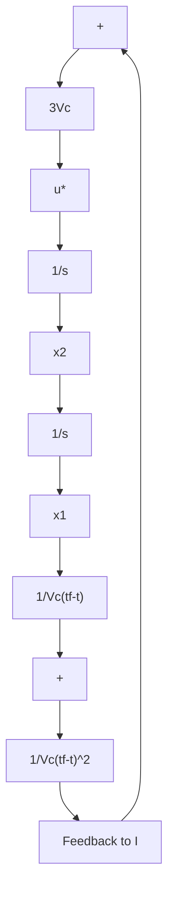

$$\boldsymbol {q} = \frac {\boldsymbol {x} _ {1}}{V _ {c} (t _ {\mathrm{f}} - t)} \tag {12-30}\dot {\boldsymbol {q}} = \frac {\boldsymbol {x} _ {1} + (t _ {\mathrm{f}} - t) \dot {\boldsymbol {x}} _ {1}}{\boldsymbol {V} _ {c} (t _ {\mathrm{f}} - t) ^ {2}} = \frac {1}{\boldsymbol {V} _ {c}} \left[ \frac {\boldsymbol {x} _ {1}}{(t _ {\mathrm{f}} - t) ^ {2}} + \frac {\boldsymbol {x} _ {2}}{t _ {\mathrm{f}} - t} \right] \tag {12-31}$$

将上式代入式(12-29)，可得

$$\boldsymbol {u} ^ {*} (t) = - 3 \boldsymbol {V} _ {\mathrm{c}} \dot {\boldsymbol {q}} \tag {12-32}$$

在上式中， $\pmb{u}$ 的单位是加速度的单位 $\mathrm{m} / \mathrm{s}^2$ 。把 $\pmb{u}$ 与导弹速度向量 $\vec{V}_D$ 的旋转角速度 $\dot{\theta}$ 联系起来，则有

$$\boldsymbol {u} = - \boldsymbol {V} _ {M} \dot {\boldsymbol {\theta}}\dot {\pmb {\theta}} = \frac {3 \pmb {V} _ {c}}{\pmb {V} _ {M}} \dot {\pmb {q}} \tag {12-33}$$

从式(12-32)和(12-33)可以看出,当不考虑弹体惯性时,最优导引规律就是比例导引,其导航比为 $\frac{3V_{c}}{V_{M}}$ 。这证明了比例导引是一种很好的导引方法。最优导引规律的形成可用图12-7来表示。

flowchart

图12-7 最优导引方框图

下面将对最优导引律进行 MATLAB 仿真,并给出源代码和仿真结果。

最优导引攻击几何关系如图 12-8 所示, 在这里讨论的目标和导弹均认为是二维拦截几何平面上的质点, 分别以速度 $V_{T}$ 和 $V_{M}$ 运动。导弹的初始位置为相对坐标系的参考点,导弹初始速度矢量指向目标的初始位置, $a_{M}$ 为导弹的指令(垂直于视线)。

text_image

x
a_M
x_T
x_M
O
y_M
y
y_T
R_TM
q
L+HE
V_M
θ
H
T
a_T
V_T
θ_T

图12-8 最优导引攻击几何平面

其中，

$$\dot {\boldsymbol {\theta}} _ {T} = \frac {\boldsymbol {a} _ {T}}{\boldsymbol {V} _ {T}} \tag {12-34}\boldsymbol {V} _ {T \gamma} = \boldsymbol {V} _ {T} \cos \boldsymbol {\theta} _ {T} \tag {12-35}\boldsymbol {V} _ {T x} = \boldsymbol {V} _ {T} \sin \boldsymbol {\theta} _ {T} \tag {12-36}$$

$V_{Tx}, V_{Ty}$ 为目标速度在x,y轴上的分解, $\theta_{T}$ 是目标的角度。导弹和目标之间的接近速度为

$$\boldsymbol {V} _ {c} = - \dot {\boldsymbol {R}} _ {T M} \tag {12-37}$$

目标的速度分量可由其位置变化得到

$$\dot {\boldsymbol {R}} _ {T y} = \boldsymbol {V} _ {T y}, \dot {\boldsymbol {R}} _ {T x} = \boldsymbol {V} _ {T x} \tag {12-38}$$

同样地,可以得到导弹的位置和速度的微分方程:
