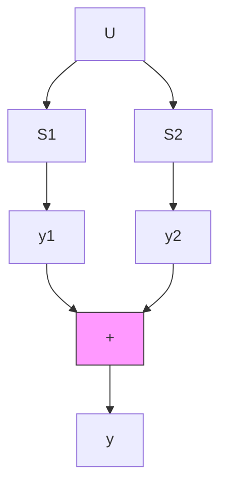

# 11.1 组合系统的能控性和能观测性

通常,可把由两个或两个以上的子系统按一定方式联接组成的系统称为组合系统。尽管组合系统的形式各异,但它们总是可以分解为几种基本的联接方式的组合,这些基本的联接方式是并联、串联和反馈。组合系统的结构特性不仅依赖于各个子系统的特性,而且在很大程度上决定于子系统间的联接方式。本节中,我们主要来研究组合系统的能控性和能观测性,并导出三种基本类型联接下系统保持能控性和能观测性所需满足的条件。

并联系统的能控性和能观测性 考虑图 11.1 所示的由两个子系统 $S_{1}$ 和 $S_{2}$ 并联组成的系统 $S_{P}$ ，其中假定子系统 $S_{1}$ 和 $S_{2}$ 是由其传递函数矩阵 $G_{1}(s)$ 和 $G_{2}(s)$ 可完全表征的，即它们的相应状态空间描述是联合能控和能观测的。再令 $G_{i}(s)$ 是 $q_{i} \times p_{i}$ 的有理分式矩阵，且表为不可简约的矩阵分式描述：

flowchart

图11.1 于系统的并联

$$G _ {i} (s) = N _ {i} (s) D _ {i} ^ {- 1} (s) = D _ {L i} ^ {- 1} (s) N _ {L i} (s), i = 1, 2 \tag {11.1}$$

并且根据联接条件还应成立

$$p _ {1} = p _ {2} = p, q _ {1} = q _ {2} = q \tag {11.2}$$

于是，就可给出并证明如下的一些有关并联系统的能控性和能观测性的结论。

结论1 对于图 11.1 所示的并联系统 $S_{P}$ ，成立如下的论断：

(i) 当 $G_{i}(s)$ 表为不可简约的右 MFD $N_{i}(s)D_{i}^{-1}(s)$ ( $i = 1, 2$ ) 时， $S_{p}$ 为能控的充分必要条件是 $\{D_{1}(s), D_{2}(s)\}$ 为左互质。

(ii) 当 $G_{i}(s)$ 表为不可简约的左 $\mathrm{MFD}^{\prime}D_{L_i}^{-1}(s)N_{L,i}(s)$ ( $i = 1,2$ ) 时， $S_{P}$ 为能观测的充分必要条件是 $\{D_{L_1}(s), D_{L_2}(s)\}$ 为右互质。

证 考虑到论断（i）和（ii）是对偶的，所以下面只限于证明论断（i）。已知 $G_{i}(s)$

$N_{i}(s)D_{i}^{-1}(s), i = 1,2,$ 故可对子系统 $S_{i}$ 引入如下的多项式矩阵描述为：

$$
\left[ \begin{array}{l l} D _ {i} (s) & I _ {p i} \\ - N _ {i} (s) & 0 \end{array} \right] \left[ \begin{array}{l} \hat {\zeta} _ {i} (s) \\ - \hat {u} _ {i} (s) \end{array} \right] = \left[ \begin{array}{c} 0 \\ - \hat {y} _ {i} (s) \end{array} \right], i = 1, 2 \tag {11.3}
$$

其中 $\hat{\pmb{\xi}}_i$ 为广义状态。注意到在子系统的并联下有如下的关系式

$$\hat {\boldsymbol {u}} _ {1} (s) = \hat {\boldsymbol {u}} _ {2} (s) = \hat {\boldsymbol {u}} (s), \hat {\boldsymbol {y}} _ {1} (s) + \hat {\boldsymbol {y}} _ {2} (s) = \hat {\boldsymbol {y}} (s) \tag {11.4}$$

所以由(11.3)和(11.4)可进而导出并联系统 $S_{P}$ 的PMD为：

$$
\left[ \begin{array}{c c c} D _ {1} (s) & \mathbf {0} & I _ {\rho} \\ \mathbf {0} & D _ {2} (s) & I _ {\rho} \\ - N _ {1} (s) & - N _ {2} (s) & \mathbf {0} \end{array} \right] \left[ \begin{array}{l} \hat {\zeta} _ {1} (s) \\ \hat {\zeta} _ {2} (s) \\ - \hat {\boldsymbol {u}} (s) \end{array} \right] = \left[ \begin{array}{c} \mathbf {0} \\ \mathbf {0} \\ - \hat {\boldsymbol {y}} (s) \end{array} \right] \tag {11.5}
$$
