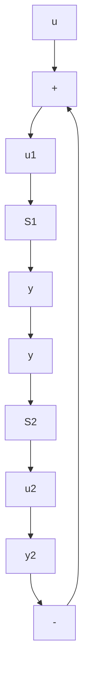

先证充分性：已知 $S_{12}$ 能控，欲证 $S_{YF}$ 能控。表 $\boldsymbol{x}^{(1)}$ 和

$x^{(2)}$ 分别为 $S_{1}$ 和 $S_{2}$ 的状态向量，

$$
\bar {x} = \left[ \begin{array}{l} x ^ {(1)} \\ x ^ {(2)} \end{array} \right]
$$

为 $S_{1}$ 和 $S_{2}$ 的组合状态。那么根据能控性定义可知，当 $S_{12}$ 为能控时，对任意的非零 $\bar{x}_0$ 和 $\bar{x}_{1}$ ，必存在控制 $\bar{u}_{1}$ ，使在有限时间区间内由 $\bar{x}_0$ 转移到 $\bar{x}_{1}$ ，同时表 $\bar{y}_{2}$ 为串联系统 $S_{12}$

flowchart

图 11.5 输出反馈系统

的由 $\vec{u}_1$ 引起的输出。由此，对输出反馈系统 $S_{YF}$ ，对任意的非零 $\vec{x}_0$ 和 $\vec{x}_1$ ，必可取控制 $\vec{u} = \vec{u}_1 + \vec{y}_2$ ，使在有限时间区间内把 $\vec{x}_0$ 转移到 $\vec{x}_1$ ，所以依定义 $S_{YF}$ 是能控的。

再证必要性：已知 $S_{YF}$ 能控，欲证 $S_{12}$ 能控。若对任意非零 $\bar{x}_0$ 和 $\bar{x}_1$ ，存在 $\bar{u}$ 使在有限时间内将 $S_{YF}$ 的状态由 $\bar{x}_0$ 转移到 $\bar{x}_1$ 。则也必可构造 $\bar{u}_1 = \bar{u} -\bar{y}_2$ ，将 $S_{12}$ 的状态在有限时间内由 $\bar{x}_0$ 转移到 $\bar{x}_1$ ，所以 $S_{12}$ 为能控。于是，证明完成。

下面,我们来指出由上述基本结论所导出的一些推论:

（1）对于多输入-多输出系统，一般地说， $S_{12}$ 为能控的条件不同于 $S_{21}$ 为能观测的条件。  
(2) 但是, 对于单输入-单输出系统, 则 $S_{12}$ 为能控的条件将等同于 $S_{21}$ 为能观测的条件, 也就是没有一个 $g_{2}(s)$ 的极点为 $g_{1}(s)$ 的零点所对消。  
(3) 图 11.5 所示的单输入-单输出的输出反馈系统 $S_{YF}$ 为能控和能观测的充分必要条件, 是没有一个 $g_{2}(s)$ 的极点为 $g_{1}(s)$ 的零点所对消。  
（4）如果图11.5的输出反馈系统中，子系统 $S_{2}$ 的传递函数矩阵 $G_{2}(s) = F$ 为常阵，则输出反馈系统 $S_{\mathrm{YF}}$ 为能控和能观测，当且仅当子系统 $S_{1}$ 为能控和能观测。
