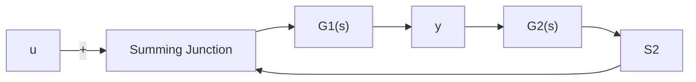

$$X (s) \left[ D _ {1} (s) + N _ {1} (s) \right] + [ Y (s) - X (s) ] N _ {1} (s) = I \tag {11.73}$$

text_image

u
+
-
S₁
G₁(s)
y₁
y

图 11.6 直接输出反馈系统

flowchart

图 11.7 具有补偿器的输出反馈系统

所以根据互质性的贝佐特等式判据又可知， $\{D_1(s) + N_1(s),N_1(s)\}$ 为右互质，也即式

(11.71)的 MFD 是不可简约的。从而, 可知成立

$$G _ {F} (s) \text {的极点为} \det [ D _ {1} (s) + N _ {1} (s) ] = 0 \text {的根} \tag {11.74}$$

也即 $S_{YF}$ 的稳定条件为 $\operatorname{det}[D_1(s) + N_1(s)] = 0$ 的根均具有负实部。于是，论断 (ii) 得证。

（3）论断（iii）的推证过程和论断（ii）的证明过程类同，故略。这样，就完成了整个证明。

具有补偿器的输出反馈系统的稳定条件 我们来讨论更为一般形式的输出反馈系统, 其反馈通道中引入了作为补偿器的子系统 $S_{2}$ , 它的结构如图 11.7 所示。同时, 假定 $S_{1}$ 和 $S_{2}$ 可由它们的传递函数矩阵 $G_{1}(s)$ 和 $G_{2}(s)$ 所完全表征, $G_{1}(s)$ 和 $G_{2}(s)$ 为真有理分式矩阵, 且 $\det [I + G_{1}(\infty)G_{2}(\infty)] \neq 0$ 。此外, $G_{1}(s)$ 和 $G_{2}(s)$ 可以用有理分式矩阵或不可简约的右或左 MFD 的形式给出。

结论 对于图 11.7 所示的具有补偿器的输出反馈系统 $S_{YP}$ ， $S_{YP}$ 为渐近稳定的充分必要条件是：

(i) 当 $G_{1}(s)$ 和 $G_{2}(s)$ 以有理分式矩阵给出时，为方程

$$\Delta_ {1} (s) \Delta_ {2} (s) \det [ I + G _ {1} (s) G _ {2} (s) ] = 0 \tag {11.75}$$

的根均具有负实部，其中 $\Delta_1(s)$ 和 $\Delta_2(s)$ 分别为 $G_{1}(s)$ 和 $G_{2}(s)$ 的特征多项式。

(ii) 当采用不可简约的 MFD $G_{1}(s) = D_{L1}^{-1}(s)N_{L1}(s)$ 和 $G_{2}(s) = N_{2}(s)D_{2}^{-1}(s)$ 时，为方程

$$\det \left[ D _ {L 1} (s) D _ {2} (s) + N _ {L 1} (s) N _ {2} (s) \right] = 0 \tag {11.76}$$

的根均具有负实部。

(iii) 当采用不可简约的 MFD $G_{1}(s) = N_{1}(s)D_{1}^{-1}(s)$ 和 $G_{2}(s) = D_{L2}^{-1}(s)N_{L2}(s)$ 时，为方程 det $[D_{L2}(s)D_1(s) + N_{L2}(s)N_1(s)] = 0$ (11.77)

的根均具有负实部。

证（1）证明论断（i）。和对直接输出反馈系统的稳定性的结论推证过程相类同，若令 $A_{F}$ 为输出反馈系统的状态空间描述的系统矩阵，则可导出类似于(11.68)的关系式为：

$$
\begin{array}{l} \det (s I - A _ {F}) = \det (s I - A _ {1}) \det (s I - A _ {2}) \det [ I + G _ {1} (s) G _ {2} (s) ] \\ \times \det [ I + E _ {1} E _ {2} ] ^ {- 1} \tag {11.78} \\ \end{array}
$$

再考虑到

$$\Delta_ {1} (s) = \Delta [ G _ {1} (s) ] = \beta_ {1} \det (s I - A _ {1}) \tag {11.79}\Delta_ {2} (s) = \Delta [ G _ {2} (s) ] = \beta_ {2} \det (s I - A _ {2}) \tag {11.80}\det \left[ I + E _ {1} E _ {2} \right] = \det \left[ I + G _ {1} (\infty) G _ {2} (\infty) \right] = \beta_ {3} \neq 0 \tag {11.81}$$

那么将(11.79)—(11.81)代入(11.78)，就进而有
