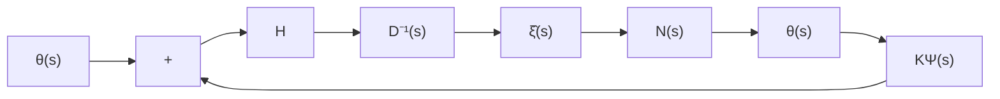

# 11.3 极点配置问题的状态反馈的综合

在第5章中,我们已经采用状态空间法讨论了线性定常系统的极点配置问题。那里,整个讨论都是建立在系统的状态空间描述 $(A,B,C)$ 的基础上的,并且只要 $(A,B)$ 是完全能控的,那么一定可找到适当的状态反馈矩阵K,使得引入状态反馈后系统的极点也即

$$\det (s I - A + B K) = 0 \tag {11.87}$$

的根等同于任意指定的期望极点值。在这一节里，我们将采用复频率域法来研究极点配置问题，其问题的提法是：给定系统的传递函数矩阵 $G_{o}(s)$ ，并进一步将其表为矩阵分式描述 $G_{o}(s) = N(s)D^{-1}(s)$ ，再引入状态反馈可得到状态反馈系统的传递函数矩阵为

$$G (s, K) = N (s) D _ {K} ^ {- 1} (s) \tag {11.88}$$

于是问题就化为确定一个适当的状态反馈矩阵 $K$ ，使得

$$\det D _ {K} (s) = 0 \tag {11.89}$$

的根等同于也即配置于任意指定的一组期望极点值。下面将可看到，采用复频率域法来求解极点配置问题，一个比较突出的优点是综合过程较为简单和直观。

状态反馈特性的复频率域分析 在具体阐明极点配置问题的综合方法以前，有必要先对状态反馈的特性从复频率域的角度进行分析。如同在11.1节中已导出的，状态反馈系统的用于复频率域分析的结构图具有图11.4(b)所示的形式，并且状态反馈系统的传递函数矩阵为

$$G (s, K) = N (s) D _ {K} ^ {- 1} (s) \tag {11.90}$$

其中

$$D _ {K} (s) = D _ {h c} S (s) + \left(D _ {l c} + K\right) \Psi (s) \tag {11.91}$$

式中， $S(s)$ 和 $\Psi (s)$ 分别为 $D(s)$ 的列次阵和低次阵， $D_{bc}$ 和 $D_{lc}$ 为相应的列次系数阵和低次系数阵，也即成立

$$D (s) = D _ {k c} S (s) + D _ {l c} \Psi (s) \tag {11.92}$$

从(11.90)和(11.91)可立即得到如下的一个结论,它具体地表征了状态反馈的引入可对系统能影响什么和不能影响什么。

结论1 对于图11.4(b)所示的状态反馈系统 $S_{XP}$ ，状态反馈矩阵 $K$ 的引入的作用表现为：

① 不会改变分母矩阵 $D(s)$ 的列次数，也即必成立

$$\delta_ {c i} D _ {\kappa} (s) = \delta_ {c i} D (s), i = 1, 2, \dots , p \tag {11.93}$$

② 不会直接影响分子矩阵 $N(s)$ ，即 $G(s, K)$ 和 $G_{\bullet}(s)$ 具有相同的分子矩阵。

③ 不影响分母矩阵 $D(s)$ 的列次系数阵 $D_{hc}$ ，即 $D_{K}(s)$ 和 $D(s)$ 具有相同的列次系数阵。

④ 可完全改变分母矩阵 $D(s)$ 的低次系数阵 $D_{lco}$

结论1表明,通过引入状态反馈阵K,可对系统的极点实现任意配置,且在整体上不影响系统的零点的分布。但是,就传递函数矩阵的每一个元传递函数而言,状态反馈阵K的引入,在改变它们的极点的同时,也将同时导致其零点的改变。这就是为什么对导致相同的极点配置的不同反馈阵K,系统的各个状态变量的时间域行为可有明显的差别。

进一步,为了可同时改变分母阵 $D(s)$ 的列次系数矩阵 $D_{bc}$ 和低次系数矩阵 $D_{lc}$ ,需要在引入状态反馈的同时，附加引入非奇异的输入变换，而构成图11.8所示形式的状态反馈系统结构图。图中，H为输入变换阵，且 $\det H \neq 0$ 。

由图 11.8 的结构图容易导出，包含输入变换的状态反馈系统的传递函数矩阵为

flowchart

图 11.8 包含输入变换的状态反馈系统

$$
\begin{array}{l} G _ {H} (s, K) = N (s) \left[ H ^ {- 1} D (s) + K \Psi (s) \right] ^ {- 1} \\ = N (s) \left[ H ^ {- 1} D _ {h c} S (s) + H ^ {- 1} D _ {l c} \Psi (s) + K \Psi (s) \right] ^ {- 1} \\ = N (s) \left[ H ^ {- 1} D _ {h c} S (s) + \left(H ^ {- 1} D _ {l c} + K\right) \Psi (s) \right] ^ {- 1} \\ = N (s) D _ {K H} ^ {- 1} (s) \tag {11.94} \\ \end{array}
$$

其中，分母矩阵 $D_{\kappa H}(s)$ 的表达式为
