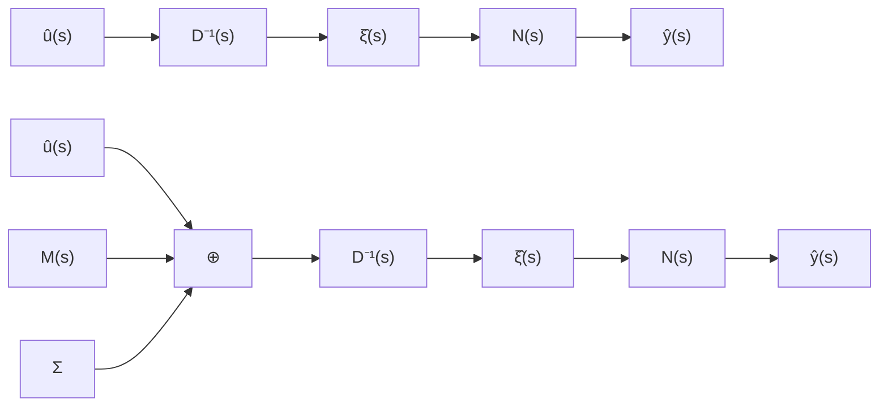
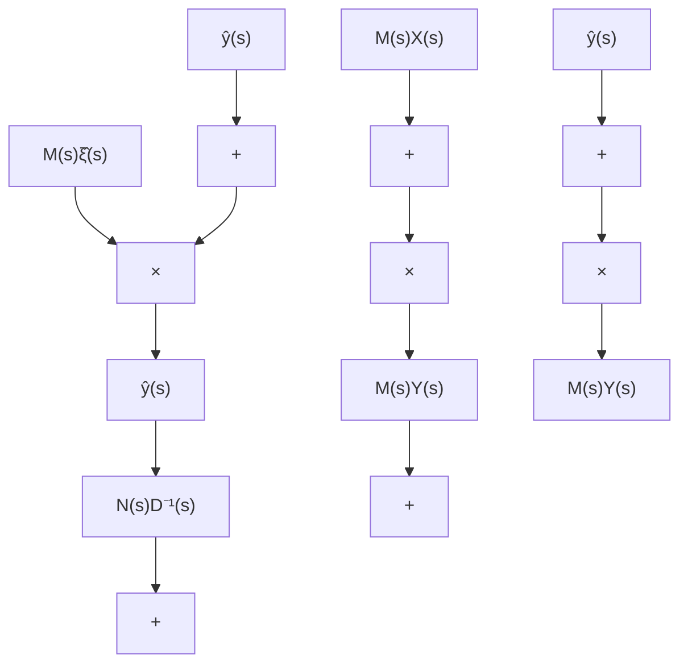

$$G _ {F} (s) = N (s) [ D (s) + M (s) ] ^ {- 1} \tag {11.129}$$

但根据综合指标的要求又有

$$G _ {F} (s) = N (s) D _ {F} ^ {- 1} (s) \tag {11.130}$$

其中 $D_{F}(s)$ 已在前一部分中定出。这样，由(11.129)和(11.130)就可定出，补偿器的传递特性为

$$M (s) = D _ {F} (s) - D (s) \tag {11.131}$$

但是，应当指出，按照(11.131)确定的补偿器及相应的闭环系统在物理上是不能实现的。这是由于，所采用的反馈变量 $\hat{\zeta}(s)$ 一般是不能量测的，而 $M(s)$ 为多项式矩阵在物理上是无法实现的。所以，下面我们进而来解决这两方面的问题。

解决反馈方式的可实现性问题 基本思路和采用状态观测器的思路相类似，即利用可量测变量 $\hat{\pmb{u}}(s)$ 和 $\hat{\pmb{y}}(s)$ 来等价地取代不可量测变量 $\hat{\pmb{\zeta}}(s)$ 。为此，考虑到 $\{D(s), N(s)\}$ 为右互质，故由互质性的贝佐特等式判据知，必存在多项式矩阵 $X(s)$ 和 $Y(s)$ ，使成立

$$X (s) D (s) + Y (s) N (s) = I \tag {11.132}$$

据此并考虑到(11.128)，就可把反馈输入化为：

$$
\begin{array}{l} M (s) \dot {\zeta} (s) = M (s) [ X (s) D (s) + Y (s) N (s) ] \hat {\zeta} (s) \\ = M (s) X (s) D (s) \hat {\zeta} (s) + M (s) Y (s) N (s) \hat {\zeta} (s) \\ = M (s) X (s) \hat {\boldsymbol {u}} (s) + M (s) Y (s) \hat {\boldsymbol {y}} (s) \tag {11.133} \\ \end{array}
$$

这样，就把反馈输入中的反馈变量由 $\hat{\zeta}(s)$ 等价地换成了可以直接量测的 $\hat{y}(s)$ 和 $\hat{u}(s)$ ，从而解决了反馈方式的物理可实现性问题。相应地，闭环系统的结构图则由图11.9(b)而

flowchart

图 11.9 (a) 开环系统的结构图 (b) 引入补偿器后闭环系统的结构图

flowchart

图 11.10 观测器—控制器型状态反馈系统

化成了图 11.10 所示的形式。

进一步,我们引入可逆的待定多项式矩阵 $T(s)$ ,并将(11.133)进而表为

$$
\begin{array}{l} M (s) \hat {\zeta} (s) = T ^ {- 1} (s) [ T (s) M (s) X (s) \hat {\boldsymbol {u}} (s) + T (s) M (s) Y (s) \hat {\boldsymbol {y}} (s) ] \\ = T ^ {- 1} (s) F (s) \hat {\boldsymbol {u}} (s) + T ^ {- 1} (s) H (s) \hat {\boldsymbol {y}} (s) \tag {11.134} \\ \end{array}
$$

其中， $T^{-1}(s)F(s)$ 和 $T^{-1}(s)H(s)$ 为以左MFD形式给出的补偿器的传递函数矩阵，而 $F(s) = T(s)M(s)X(s),H(s) = T(s)M(s)Y(s)$ (11.135)
