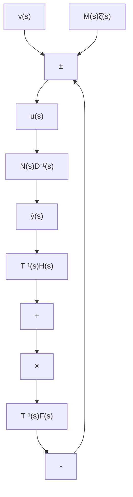
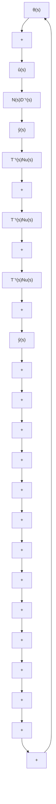

图 11.11 观测器—控制器型状态反馈系统

flowchart

图 11.12 观测器—控制器型状态反馈系统

其次，我们选取

$$
T (s) = \left[ \begin{array}{c c c c} s ^ {v - 1} + \beta_ {1} (s) & - 1 & & \\ \beta_ {2} (s) & s ^ {v - 1} & & \\ \vdots & & \ddots & \\ \beta_ {p} (s) & & s ^ {v - 1} - 1 \end{array} \right] \tag {11.145}
$$

其中， $\{\beta_{i}(s), i=1,2,\cdots,p\}$ 为待选取的多项式，并且

$$\nu = \max \left\{\delta_ {r 1} D _ {L} (s), \dots , \delta_ {r q} D _ {L} (s) \right\} \tag {11.146}\deg \beta_ {i} (s) < \nu - 1, i = 1, 2, \dots , p \tag {11.147}\det T (s) = s ^ {p (v - 1)} + \beta_ {1} (s) s ^ {(p - 1) (v - 1)} + \dots + \beta_ {p} (s) \tag {11.148}$$

那么，此时有：① $T^{-1}(s)N_{y}(s)$ 必为真有理分式矩阵；② 当且仅当 $D(s)D_{F}^{-1}(s)$ 为正则的真有理分式矩阵；即 $D(s)D_{F}^{-1}(s)$ 当 $s = \infty$ 时为非奇异有限常阵时， $T^{-1}(s)N_{u}(s)$ 为真有理分式阵。

我们下面来证明这个论断。① 由(11.146)知， $\nu$ 为 $D_{L}(s)$ 的最大行次数，而它必然也是 $D_{L}(s)$ 的最大列次数。再由(11.136)知， $N_{y}(s)$ 的列次数小于 $D_{L}(s)$ 的列次数。

于是，由这两点即可知， $N_{y}(s)$ 的列次数均小于等于 $\nu-1$ ，而这又等同于其行次数满足关系式：

$$\delta_ {r i} N _ {y} (s) \leqslant v - 1, i = 1, 2, \dots , p \tag {11.149}$$

但 $T(s)$ 已取定如(11.145)所示，可以看出它必是行既约的，且有

$$\delta_ {r i} T (s) \leqslant v - 1, i = 1, 2, \dots , p \tag {11.150}$$

这样, 根据 MFD 的真性判据就即可得到结论, $T^{-1}(s)N_{y}(s)$ 为真有理分式矩阵。② 由 (11.143) 可导出:

$$N _ {u} (s) D (s) + N _ {y} (s) N (s) = T (s) M (s) \tag {11.151}$$

但由(11.131)知 $M(s) = D_{F}(s) - D(s)$ ，将此代入上式并加以整理，得到

$$\left[ N _ {u} (s) + T (s) \right] D (s) + N _ {y} (s) N (s) = T (s) D _ {F} (s) \tag {11.152}$$

注意到 $T(s)$ 和 $D_{F}(s)$ 均为可逆阵，则将上式左乘 $T^{-1}(s)$ 和右乘 $D_{F}^{-1}(s)$ ，可进而有

$$T ^ {- 1} (s) \left[ N _ {u} (s) + T (s) \right] D (s) D _ {F} ^ {- 1} (s) + T ^ {- 1} (s) N _ {y} (s) N (s) D _ {F} ^ {- 1} (s) = I \tag {11.153}$$

或将其表示为如下的形式：
