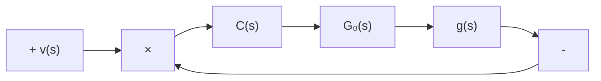

# 11.5 采用输出反馈时极点配置问题的补偿器的综合

由于采用输出变量组这种在物理上可量测的变量作为反馈变量，使得输出反馈具有很好的物理可实现性。但是，正如在状态空间法的讨论中所曾经指出过的，仅仅采用输出反馈不能任意配置系统的全部极点。解决的途径之一，就是同时引入补偿器，构成如图11.13所示形式的闭环系统结构。图中，受控系统用其传递函数矩阵 $G_{o}(s)$ 来完全表征，并且总是假定 $G_{o}(s)$ 是严格真的或真的；由传递函数矩阵 $C(s)$ 所表征的部分称为补偿器，综合问题的任务就是根据期望的极点配置的要求来确定补偿器的 $C(s)$ ，此外总是要求 $C(s)$ 必须是真的或严格真的以保证其物理可实现性。

要解决上述所定义的输出反馈极点配置问题，面临着两个有待讨论的问题。一个属于理论问题，即要确定在什么条件下物理上可实现的补偿器是存在的，显然只有这个前提条件得到满足的情况下对补偿器才可进行综合。另一

flowchart

图11.13 具有补偿器的单位输出反馈系统

个是算法问题，即综合补偿器的具体计算方法和步骤。在下面的讨论中，我们将分成两种情况来进行综合，首先限于讨论受控系统的传递函数矩阵 $G_{0}(s)$ 为循环时的极点配置问题，随后利用所导出的结果推广讨论受控系统的传递函数矩阵 $G_{0}(s)$ 为非循环的情况。

传递函数矩阵的循环性 我们先来引入循环的概念。给定 $q \times p$ 的传递函数矩阵 $G_{o}(s)$ ，表

$$\Delta (s) = G _ {o} (s) \text {的特征多项式} \tag {11.167}$$

它即为 $G_{o}(s)$ 的所有 1 阶、2 阶、…， $\min\{q,p\}$ 阶子式的最小公分母；再表

$$\phi (s) = G _ {o} (s) \text {的最小多项式} \tag {11.168}$$

它即为 $G_{o}(s)$ 的所有元传递函数的最小公分母，也就是 $G_{o}(s)$ 的所有1阶子式的最小公分母。一般情况下，成立

$$\Delta (s) = k (s) \phi (s) \tag {11.169}$$

其中 $k(s)$ 为标量多项式。如果，对给定的 $G_{o}(s)$ ，其特征多项式和最小多项式间成立

$$\Delta (s) = k \phi (s), k \text {为非零常数} \tag {11.170}$$

则称此 $G_{s}(s)$ 为循环有理分式矩阵。研究表明，循环有理分式矩阵具有一些很好的性质，利用这种性质将可使本节中所要讨论的输出反馈极点配置问题的综合过程大为简化。

例 给定传递函数矩阵 $G_{o1}(s)$ 和 $G_{o2}(s)$ 分别为：

$$
G _ {0 1} (s) = \left[ \begin{array}{c c c} \frac {1}{s + 2} & \frac {3}{s + 2} & 0 \\ \frac {1}{s + 2} & 0 & \frac {1}{s + 2} \end{array} \right]

G _ {0 2} (s) = \left[ \begin{array}{c c c} \frac {1}{s + 2} & \frac {1}{s + 2} & \frac {1}{s + 2} \\ \frac {1}{s + 2} & \frac {s + 3}{s + 2} & \frac {2 s + 5}{s + 2} \end{array} \right]
$$

容易定出

$$\phi_ {1} (s) = s + 2, \Delta_ {1} (s) = (s + 2) ^ {2}\phi_ {2} (s) = s + 2, \Delta_ {2} (s) = s + 2$$

这表明， $G_{o1}(s)$ 不是循环有理分式矩阵，而 $G_{o2}(s)$ 是循环有理分式矩阵。

从定义出发,我们可进一步指出循环有理分式矩阵的如下一些性质:

(1) 如果 $G_{o}(s)$ 为 $1 \times p$ 或 $q \times 1$ 的有理分式矩阵，则 $G_{o}(s)$ 必是循环的。

(2) 给定 $q \times p$ 的有理分式矩阵 $G_{o}(s)$ , 表 $g_{ij}(s)$ 和 $g_{\alpha \beta}(s)$ 为它的任意两个元有理分式, $i \neq \alpha, j \neq \beta, i = 1, 2, \cdots, q, j = 1, 2, \cdots, p$ 。则当不存在一个 $\lambda$ 是它们的公共极点时, 即使得

$$g _ {i j} (\lambda) = \infty \text {和} g _ {\alpha \beta} (\lambda) = \infty$$

同时成立时， $G_{o}(s)$ 必是循环的。
