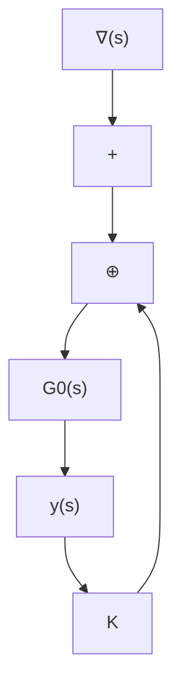

这个性质对于判断 $G_{o}(s)$ 是否为循环是很方便的。但是，值得指出的是，这是一个充分条件，当不满足此性质的条件时 $G_{o}(s)$ 仍有可能是循环的。

(3) 设 $G_{o}(s)$ 为 $q \times p$ 的循环真有理分式矩阵, 则对几乎所有的 $p \times 1$ 实常数向量 $\pmb{t}_{1}$ 和 $1 \times q$ 的实常数向量 $\pmb{t}_{2}$ , 存在非零常数 $k_{1}$ 和 $k_{2}$ 使成立

$$\Delta [ G _ {o} (s) ] = k _ {1} \Delta [ G _ {o} (s) t _ {1} ] = k _ {2} \Delta [ t _ {2} G _ {o} (s) ] \tag {11.171}$$

这个性质对于下面将要讨论的输出反馈极点配置问题将是很重要的。现在，我们来证明这个性质。表

$$
G _ {o} (s) = \frac {1}{\phi (s)} N (s) = \frac {1}{\phi (s)} \left[ \begin{array}{c} N _ {1} (s) \\ \vdots \\ N _ {q} (s) \end{array} \right] \tag {11.172}
$$

其中， $N(s)$ 为 $q \times p$ 的多项式矩阵， $N_{i}(s)$ 为 $N(s)$ 的第 i 个行。再假定 $G_{o}(s)$ 的每一个元有理分式都是不可简约的，且 $G_{o}(s)$ 为循环意味着 $\Delta[G_{o}(s)] = k_{1}\phi(s)$ 。现令 $\phi(s) = 0$ 也即 $\Delta[G_{o}(s)] = 0$ 的根均为两两相异，记为 $\lambda_{1}, \lambda_{2}, \cdots, \lambda_{n}$ 。并先限于讨论 $\lambda_{i}$ 为实根的情况，此时由 $G_{o}(s)$ 的元的不可简约性可知，对 $\lambda_{i} (i = 1, 2, \cdots, n)$ 有

$$N (\lambda_ {i}) \neq 0 \text {即} \operatorname{rank} N (\lambda_ {i}) \geqslant 1, \forall i \tag {11.173}$$

表明满足 $N(\lambda_i)t = 0$ 的非零 $p \times 1$ 实常数向量 $\pmb{t}$ 的集合构成最多为 $p - 1$ 维的线性空间 $\mathcal{N}$ ，而对不位于 $\mathcal{N}$ 的 $p \times 1$ 实常数向量 $\pmb{t}_1$ 有

$$N (\lambda_ {i}) t _ {1} \neq 0, i = 1, 2, \dots , n \tag {11.174}$$

而这进一步意味着在关系式

flowchart

图 11.14 常反馈阵输出反馈系统

$$
G _ {o} (s) \dot {\boldsymbol {t}} _ {1} = \frac {1}{\phi (s)} \left[ \begin{array}{c} N _ {1} (s) \dot {\boldsymbol {t}} _ {1} \\ \vdots \\ N _ {q} (s) \dot {\boldsymbol {t}} _ {1} \end{array} \right] \tag {11.175}
$$

中， $\phi(s)$ 和 $N_{i}(s)t_{1}$ 没有多项式公因子。因此， $\phi(s)$ 即为 $G_{o}(s)t_{1}$ 的特征多项式。进而，讨论 $\lambda_{i}$ 和 $\lambda_{i+1}$ 为共轭复数的情况，此时相对于 $N(\lambda_{i}) + N(\lambda_{i+1})$ 可推导出相类同的结论。于是，对于不属于 N 的 $t_{1}$ ，证得 $\Delta[G_{o}(s)] = k_{1}\Delta[G_{o}(s)t_{1}]$ 。再之，N 最多为 p - 1 维，所以若令 p = 2，那么 N 就是 2 维平面上的一条直线。相对于 $\lambda_{1}, \lambda_{2}, \cdots, \lambda_{n}$ ，则总共有 n 条直线。进一步，为便于比较，限于考虑范数 $\|t\| = 1$ 的实常数向量 t，则 N 仅是 2 维平面的单位圆上的 2n 个点。所以，若随机地选取 $t_{1}$ ，那么使

$$\Delta [ G _ {o} (s) ] = k _ {1} \Delta [ G _ {o} (s) t _ {1} ]$$

的概率几乎为1。这就表明，对几乎所有的 $p \times 1$ 实常数向量 $t_{1}$ ，式（11.171）的前一个等式成立。类似地，也可证明(11.171)的后一个等式成立。从而证明完成。
