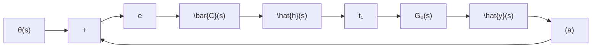

flowchart

图 11.15 具有补偿器的单位输出反馈系统

$$C (s) = \pmb {t} _ {1} \bar {C} (s) \quad \text {或} C (s) = \overline {{{C}}} (s) \pmb {t} _ {2} \tag {11.180}$$

而且，按照物理可实现性的要求， $C(s)$ 必须是真的或严格真的。于是，上述综合问题就归结为，确定一个符合物理可实现性要求的 $C(s)$ ，使得闭环系统的传递函数矩阵实现期望的极点配置。

下面，我们对上述极点配置问题来给出如下的一个基本结论。

结论 考虑图 11.15 所示的输出反馈闭环系统。令 $G_{o}(s)$ 为 $q \times p$ 的循环有理分式矩阵，表 $\mu$ 和 $\nu$ 分别为 $G_{o}(s)$ 的任意不可简约 $\mathrm{MFD} N_{o}(s) D_{o}^{-1}(s)$ 和 $D_{oL}^{-1}(s) N_{oL}(s)$ 的最大列次数和最大行次数，且表 $n$ 为 $G_{o}(s)$ 的特征多项式的次数。再令补偿器的传递函数矩阵为 $p \times q$ 的 $C(s)$ ，其次数表为 $m_{o}$ 则有如下的结论：

(1) 若 $G_{o}(s)$ 为严格真, 而 $C(s)$ 为真, 那么当 $m \geqslant \min \{\mu - 1, \nu - 1\}$ 时, 必存在 $C(s)$ 而使闭环系统的所有 $n + m$ 个极点实现任意配置。  
(2) 若 $G_{o}(s)$ 为真, 而 $C(s)$ 为严格真, 那么当 $m \geqslant \min \{\mu, \nu\}$ 时, 必存在 $C(s)$ 而使闭环系统的所有 $n + m$ 个极点实现任意配置。

证 只就图 11.15(a) 所示的闭环系统结构图来证明结论(1)，且分成如下的四个步骤来推证。

① 推导闭环系统的传递函数矩阵。由结构图, 可以导出:

$$
\left\{ \begin{array}{l} \hat {\boldsymbol {h}} (s) = \bar {C} (s) [ \hat {\boldsymbol {v}} (s) - G _ {o} (s) \boldsymbol {t} _ {1} \hat {\boldsymbol {h}} (s) ] \\ \hat {\boldsymbol {y}} (s) = G _ {o} (s) \boldsymbol {t} _ {1} \hat {\boldsymbol {h}} (s) \end{array} \right. \tag {11.181}
$$

于是，对(11.181)经过简单的推演，就得到闭环传递函数矩阵 $G_{F}(s)$ 为：

$$G _ {F} (s) = G _ {o} (s) \boldsymbol {t} _ {1} [ 1 + \bar {C} (s) G _ {o} (s) \boldsymbol {t} _ {1} ] ^ {- 1} \bar {C} (s) \tag {11.182}$$

再表

$$G _ {o} (s) \boldsymbol {t} _ {1} = N (s) D ^ {- 1} (s), \overline {{{C}}} (s) = D _ {c} ^ {- 1} (s) N _ {c} (s) \tag {11.183}$$

其中， $D(s)$ 和 $D(s)$ 均为标量多项式， $N(s)$ 为 $q \times 1$ 多项式矩阵， $N_{e}(s)$ 为 $1 \times q$ 多项式矩阵。现将(11.183)代入(11.182)，可进一步得到：

$$
\begin{array}{l} G _ {F} (s) = N (s) D ^ {- 1} (s) \left[ 1 + D _ {c} ^ {- 1} (s) N _ {c} (s) N (s) D ^ {- 1} (s) \right] ^ {- 1} D _ {c} ^ {- 1} (s) N _ {c} (s) \\ = N (s) \left[ D _ {c} (s) D (s) + N _ {c} (s) N (s) \right] ^ {- 1} N _ {c} (s) \tag {11.184} \\ \end{array}
$$

或表示为

$$G _ {F} (s) = N (s) D _ {F} ^ {- 1} (s) N _ {\epsilon} (s) = N (s) N _ {\epsilon} (s) D _ {F} ^ {- 1} (s) \tag {11.185}$$

其中
