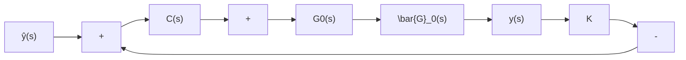

$$m \geqslant \min \{\mu , \nu \} \tag {11.196}$$

而当 $G_{\bullet}(s)$ 为严格真的时， $C(s)$ 为真且其次数为

$$m \geqslant \min \{\mu - 1, \nu - 1 \} \tag {11.197}$$

相应的输出反馈系统的结构图如图 11.16 所示。

从系统的结构图出发, 进一步可以导出, 整个闭环系统的传递函数矩阵 $G_{F}(s)$ 为:

$$
\begin{array}{l} G _ {F} (s) = [ I + \bar {G} _ {o} (s) C (s) ] ^ {- 1} \bar {G} _ {o} (s) C (s) \\ = [ I + (I + G _ {o} (s) K) ^ {- 1} G _ {o} (s) C (s) ] ^ {- 1} (I + G _ {o} (s) K) ^ {- 1} G _ {o} (s) C (s) \\ = \left[ I + G _ {o} (s) K + G _ {o} (s) C (s) \right] ^ {- 1} G _ {o} (s) C (s) \tag {11.198} \\ \end{array}
$$

现表 $G_{o}(s) = D_{L}^{-1}(s)N_{L}(s)$ ， $C(s) = t_{1}\bar{C}(s) = D_{e}^{-1}(s)t_{1}N_{c}(s)$ ，且注意到 $D_{e}(s)$ 为标量多项式，则还可把上式进而化成为

$$G _ {F} (s) = \left[ D _ {L} (s) D _ {c} (s) + N _ {L} (s) K D _ {c} (s) + N _ {L} (s) t _ {1} N _ {c} (s) \right] ^ {- 1} \cdot N _ {L} (s) t _ {1} N _ {c} (s) \tag {11.199}$$

例 给定受控系统的传递函数矩阵 $G_{o}(s)$ 为:

$$
G _ {s} (s) = \left[ \begin{array}{c c c} \frac {1}{s ^ {2}} & \frac {1}{s} & 0 \\ 0 & 0 & \frac {1}{s} \end{array} \right]
$$

容易定出， $G_{o}(s)$ 的特征多项式和最小多项式分别为：

$$\Delta (s) = s ^ {3}, \phi (s) = s ^ {2}$$

flowchart

图 11.16 $G_{o}(s)$ 为非循环时的输出反馈系统

所以，可知 $G_{\bullet}(s)$ 是非循环的，且其次数 $n = 3$ 。现任意地选取预置输出反馈增益阵

$$
K = \left[ \begin{array}{r r} 1 & - 1 \\ - 1 & 0 \\ 2 & 1 \end{array} \right]
$$

那么, 可通过计算定出 $\overline{G}_{o}(s)$ 为:

$$
\begin{array}{l} \bar {G} _ {o} (s) = \left[ I + G _ {o} (s) K \right] ^ {- 1} G _ {o} (s) \\ = \left[ \begin{array}{c c c} \frac {s + 1}{s ^ {3} + 3} & \frac {s (s + 1)}{s ^ {3} + 3} & \frac {1}{s ^ {3} + 3} \\ \frac {- 2}{s ^ {3} + 3} & \frac {- 2 s}{s ^ {3} + 3} & \frac {s ^ {2} - s + 1}{s ^ {3} + 3} \end{array} \right] \\ \end{array}
$$

容易看出， $\overline{G}_o(s)$ 的最小多项式为：

$$\phi (s) = s ^ {3} + 3$$

又因 $\overline{G}_o(s)$ 的2阶子式分别为：

$$m _ {2 1} (s) = \frac {1}{(s ^ {3} + 3) ^ {2}} [ - 2 s (s + 1) + 2 s (s + 1) ] = 0m _ {2 2} (s) = \frac {1}{(s ^ {3} + 3) ^ {2}} [ s (s + 1) (s ^ {2} - s + 1) + 2 s ] = \frac {s}{s ^ {3} + 3}m _ {2 3} (s) = \frac {1}{(s ^ {3} + 3) ^ {2}} [ (s + 1) (s ^ {2} - s + 1) + 2 ] = \frac {1}{s ^ {3} + 3}$$

可知 $\overline{G}_o(s)$ 的特征多项式为

$$\Delta (s) = s ^ {3} + 3 = \phi (s)$$

这表明， $\vec{G}_o(s)$ 为循环有理分式矩阵。并且，容易看出， $\vec{G}_o(s)$ 保持为严格真。再注意到，系统输出维数 $q = 2$ 小于输入维数 $p = 3$ ，所以一般地说其能控性指数 $\mu$ 会小于能观测性指数 $\nu$ 。由此，我们采用图11.15(b)所示形式的输出反馈一补偿器结构，且随机地任取 $t_2 = [10]$ ，则有
