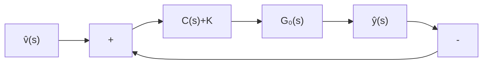

一点说明 在上面的讨论中, 把可实现极点任意配置的补偿器 $C(s)$ 的次数 $m$ , 视受控系统的传递函数矩阵 $G_{o}(s)$ 为严格真或真有理分式矩阵, 分别限制为 $m \geqslant \min \{\mu - 1, \nu - 1\}$ 或 $m \geqslant \min \{\mu, \nu\}$ 。这里我们需要补充说明, 尽管这样的选取是充分的, 但很可能是不必要的, 也即它并不是实现综合目标的补偿器的最小次数。这就产生了一个综合最小次补偿器的问题, 它既是有着实际意义的课题, 也是具有理论兴趣的课题, 但可惜至今尚未找到解决这一问题的完善的理论结果。

flowchart

图 11.17 $G_{0}(s)$ 为非循环时的输出反馈系统
