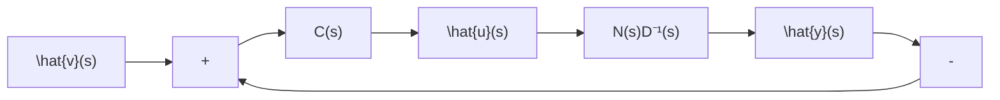

# 11.6 采用输出反馈时解耦控制问题的补偿器的综合

解耦控制问题的实质, 是把一个具有耦合的多输入-多输出控制系统, 通过选择适当的补偿器, 而将其解耦为多个独立的单输入-单输出控制系统。解耦控制在生产过程控制中有着广泛的应用,它既可采用状态反馈来实现,也可采用输出反馈来实现。本节中,我们限于讨论采用输出反馈时的解耦控制问题,并且着重阐明补偿器的综合方法。

动态解耦控制问题 考虑输入维数和输出维数相等的一个受控系统，设其可用传递函数矩阵

$$G _ {o} (s) = N (s) D ^ {- 1} (s) \tag {11.200}$$

完全表征, 其中 $N(s)$ 和 $D(s)$ 均为 $p \times p$ 多项式矩阵。再假定 $G_{o}(s)$ 是真的或严格真的, 并构成图 11.18 的输出反馈系统, 其中 $C(s)$ 表示所引入的补偿器的传递函数矩阵。

所谓动态解耦控制问题,就是要综合一个物理上可实现的 $C(s)$ , 使得闭环系统的传递函数矩阵

$$G _ {F} (s) = G _ {o} (s) C (s) \left[ I + G _ {o} (s) C (s) \right] ^ {- 1} \tag {11.201}$$

是非奇异的对角线形有理分式矩阵。

从时间域的角度而言，也就是要使图11.18的输出反馈系统中，实现：

flowchart

图 11.18 解耦控制问题的输出反馈系统

输出变量 $y_{i}(t)$ 可由且仅由参考输入变量 $v_{i}(t)$ 所完全控制， $i=1,2,\cdots,p$ (11.202)

显然，当这一点得以实现时，在整个动态过程中，一个 $p$ 维多输入-多输出系统就等价于 $p$ 个独立的单输入-单输出系统。

采用输出反馈实现解耦控制的一种方案 在此方案中, 进一步假定 $G_{o}(s)$ 是非奇异的, 即 $G_{o}^{-1}(s)$ 存在, 且同时假定其矩阵分式描述 (11.200) 中 $D(s)$ 为稳定分母矩阵, 即 $\det D(s) = 0$ 的根均具有负实部。在此基础上, 选取补偿器的传递函数矩阵 $C(s)$ 为

$$C (s) = G _ {o} ^ {- 1} (s) P (s) = D (s) N ^ {- 1} (s) P (s) \tag {11.203}$$

其中 $P(s)=\mathrm{diag}(\beta_{1}(s)/\alpha_{1}(s),\cdots,\beta_{p}(s)/\alpha_{p}(s))$ ， $\beta_{i}(s)$ 和 $\alpha_{i}(s)$ 为待定的多项式。相应地，系统的组成结构图如图 11.19 所示。

由图 11.19 的系统结构图, 可以导出, 系统开环传递函数矩阵为

$$G _ {o} (s) C (s) = N (s) D ^ {- 1} (s) \cdot D (s) N ^ {- 1} (s) P (s) = P (s) \tag {11.204}$$

从而可得输出反馈系统的闭环传递函数矩阵为

$$
\begin{array}{l} G _ {F} (s) = P (s) [ I + P (s) ] ^ {- 1} \\ - \left[ \begin{array}{c c c} \frac {\beta_ {1} (s)}{\alpha_ {1} (s) + \beta_ {1} (s)} & & \\ & \ddots & \\ & & \frac {\beta_ {p} (s)}{\alpha_ {p} (s) + \beta_ {p} (s)} \end{array} \right] \tag {11.205} \\ \end{array}
$$

这表明，在将 $C(s)$ 选取为（11.203）的形式下，所构成的输出反馈系统就实现了解耦控制，即化成了 $\pmb{p}$ 个独立的单输入-单输出控制系统，其解耦后的单输入-单输出系统的传递函数为：

$$g _ {F i} (s) = \frac {\beta_ {i} (s)}{\alpha_ {i} (s) + \beta_ {i} (s)}, i = 1, 2, \dots , p \tag {11.206}$$

而且，由于 $\beta_{i}(s)$ 和 $\alpha_{i}(s)$ 为待定多项式，故可通过对它们的适当选择而满足附加的其他

flowchart

