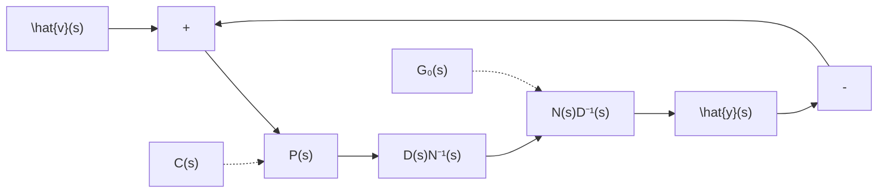

图 11.19 输出反馈解耦控制系统的一种方案

性能要求,如期望的极点配置等。进而,若令 $G_{o}^{-1}(s)$ 为:

$$
G _ {o} ^ {- 1} (s) = \left[ \begin{array}{c c} h _ {1 1} (s) & \dots h _ {1 p} (s) \\ \vdots & \vdots \\ h _ {p 1} (s) & \dots h _ {p p} (s) \end{array} \right] \tag {11.207}
$$

则补偿器的传递函数矩阵 $C(s)$ 还可表示为

$$
C (s) = G _ {o} ^ {- 1} (s) P (s) = \left[ \begin{array}{c c} \frac {\beta_ {1} (s)}{\alpha_ {1} (s)} h _ {1 1} (s) \dots \frac {\beta_ {p} (s)}{\alpha_ {p} (s)} h _ {1 p} (s) \\ \vdots & \vdots \\ \frac {\beta_ {1} (s)}{\alpha_ {1} (s)} h _ {p 1} (s) \dots \frac {\beta_ {p} (s)}{\alpha_ {p} (s)} h _ {p p} (s) \end{array} \right] \tag {11.208}
$$

于是，剩下的问题就归结为，如何来保证 $C(s)$ 的真性或严格真性，以及 $G_{F}(s)$ 的真性或严格真性。前者是由于物理可实现性的要求，后者则出自于抑制高频噪声的实际要求。

下面,我们分成两类情况,来讨论和解决反馈系统的物理可实现性问题,也即 $C(s)$ 和 $G_{F}(s)$ 的真性或严格真性问题。

情况 I: $N(s)$ 为稳定多项式矩阵, 即 $\det N(s)=0$ 的根均具有负实部。此种情况下, 可选取

$$\beta_ {i} (s) = 1, i = 1, 2, \dots , p \tag {11.209}$$

于是，相应地可导出补偿器和整个输出反馈系统的传递函数矩阵分别为：

$$
C (s) = \left[ \begin{array}{c c} \frac {1}{\alpha_ {1} (s)} h _ {1 1} (s) \dots \frac {1}{\alpha_ {p} (s)} h _ {1 p} (s) \\ \vdots & \vdots \\ \frac {1}{\alpha_ {1} (s)} h _ {p 1} (s) \dots \frac {1}{\alpha_ {p} (s)} h _ {p p} (s) \end{array} \right] \tag {11.210}
$$

和

$$
G _ {F} (s) = \left[ \begin{array}{c c c} \frac {1}{1 + \alpha_ {1} (s)} & & \\ & \ddots & \\ & & \frac {1}{1 + \alpha_ {p} (s)} \end{array} \right] \tag {11.211}
$$

这表明, 当选取 $\alpha_{i}(s)$ 满足关系式:

$$\deg \alpha_ {i} (s) \geqslant \max _ {i} [ \deg n _ {i j} (s) - \deg d _ {i j} (s) ], j = 1, 2, \dots , p \tag {11.212}$$

时， $C(s)$ 必为真的或严格真的有理分式矩阵。其中， $n_{ij}(s)$ 和 $d_{ii}(s)$ 分别是 $h_{ij}(s)$ 的分子多项式和分母多项式。而 $G_{F}(s)$ 必为真的或严格真的有理分式矩阵，并且 $\alpha_{j}(s)$ 的系数可根据其他的性能要求(如期望的极点配置等)来加以确定。

情况 II: $N(s)$ 为不稳定多项式矩阵, 即 $\det N(s) = 0$ 包含实部为正的根。对于这种情况, 把 $\beta_{i}(s)$ 取为 $N^{-1}(s)$ 的第 $j$ 列中各个元有理分式对应于不稳定极点的最小公分母。显然, 在这样的选取下, 就可使

$$
N ^ {- 1} (s) \left[ \begin{array}{c c c} \beta_ {1} (s) & & \\ & \ddots & \\ & & \beta_ {p} (s) \end{array} \right] = \widetilde {N} ^ {- 1} (s) \tag {11.213}
$$

的特征多项式是稳定的,即其特征根的实部均为负的。从而,进一步可知补偿器的传递函数矩阵
