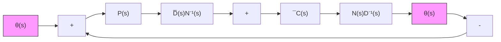
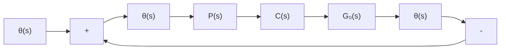

图 11.20 $G_{s}(s)$ 不稳定时解耦控制系统结构

先引入稳定补偿器 $\widetilde{C}(s)$ ，使内环反馈系统是稳定的，且其传递函数矩阵表为：

$$\bar {G} _ {o} (s) = G _ {o} (s) \tilde {C} (s) [ I + G _ {o} (s) \tilde {C} (s) ] ^ {- 1} = \bar {N} (s) \bar {D} ^ {- 1} (s) \tag {11.219}$$

其中 $\overline{D}(s)$ 为稳定多项式矩阵。再对 $\overline{N}(s)\overline{D}^{-1}(s)$ 按上述方案那样，引入解耦补偿器

$$C (s) = \overline {{{D}}} (s) \overline {{{N}}} ^ {- 1} (s) P (s) \tag {11.220}$$

并确定 $P(s)$ 的具体形式, 就实现了解耦控制。此种情况下解耦控制系统的结构图如图 11.20 所示。

（3）由于上述解耦控制方案是依靠准确的零点一极点对消来实现的，所以 $G_{\bullet}(s)$ 或 $C(s)$ 的任何一点摄动，都会导致解耦性的被破坏。这既是这种方案的主要缺点，通常也是动态解耦控制的主要缺点。

静态解稠控制问题 考虑图 11.21 所示的输出反馈系统。其中受控系统可由 $q \times p$ 的传递函数矩阵 $G_{\bullet}(s)$ 所完全表征，且假定 $G_{\bullet}(s)$ 为真的或严格真的。参考输入

$$\boldsymbol {v} (t) = d 1 (t),$$

其中d为 $q \times 1$ 的常数向量， $1(t)$ 为单位阶跃函数。再表 $G_{F}(s)$ 为整个输出反馈闭环系统的的传递函数矩阵，那么可导出输出 $y(t)$ 的拉普拉斯变换式为：

flowchart

图 11.21 输出反馈静态解耦控制系统

$$\hat {y} (s) = G _ {F} (s) \hat {v} (s) = \frac {1}{s} G _ {F} (s) d \tag {11.221}$$

而运用拉普拉斯变换的终值定理,又可导出输出 $y(t)$ 的稳态值为

$$\lim _ {t \rightarrow \infty} \mathbf {y} (t) = \lim _ {t \rightarrow 0} s \hat {\mathbf {y}} (s) = \lim _ {t \rightarrow 0} G _ {F} (s) \mathbf {d} = G _ {F} (0) \mathbf {d} \tag {11.222}$$

表明当 $G_{p}(0)$ 为非奇异对角线常阵时, 成立

$$\lim _ {t \rightarrow \infty} y _ {i} (t) = h _ {i} d _ {i}, i = 1, 2, \dots , q \tag {11.223}$$

从而称系统实现了静态解耦。其中， $y_{i}(t)$ 为 $\mathbf{y}(t)$ 的第 i 个分量， $G_{F}(0)=\mathrm{diag}\left\{h_{1},\cdots,h_{q}\right\}$ ， $d_{i}$ 为 d 的第 i 个常分量。由上分析可知，所谓静态解耦问题就是寻找补偿器 $C(s)$ 和 $P(s)$ ，使得所导出的闭环传递函数矩阵 $G_{F}(s)$ 当 $s\neq0$ 时为 $q\times q$ 的非对角线有理分式矩阵，而当 s=0 时 $G_{F}(0)$ 为非奇异的对角线常阵。

下面，我们来综合补偿器的传递函数矩阵 $C(s)$ 和 $P(s)$ 。为此，先来定出系统的闭环传递函数矩阵 $G_{P}(s)$ 为：

$$G _ {F} (s) = \left[ I + G _ {0} (s) C (s) P (s) \right] ^ {- 1} G _ {o} (s) C (s) P (s) \tag {11.224}$$

而系统的由参考输入 $\pmb{v}$ 到误差信号 $\pmb{e}$ 的传递函数矩阵 $G_{EV}(s)$ 则为：

$$G _ {E V} (s) = \left[ I + G _ {o} (s) C (s) P (s) \right] ^ {- 1} \tag {11.225}$$
