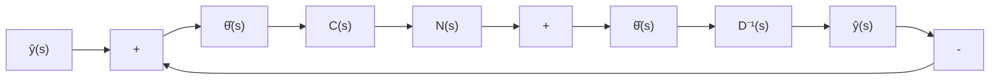

# 11.7 采用输出反馈时无静差跟踪控制问题的补偿器的综合

问题的提法 考察图 11.22 所示的多输入-多输出的包含补偿器的输出反馈系统。受控系统可由 $q \times p$ 的真传递函数矩阵 $G_{o}(s)$ 所完全表征，且将其表示为左互质 MFD $G_{o}(s) = D^{-1}(s)N(s)$ ，其中 $D(s)$ 和 $N(s)$ 分别为 $q \times q$ 和 $q \times p$ 的多项式矩阵。补偿器由 $p \times q$ 的传递函数矩阵 $C(s)$ 所完全表征，从物理可实现性的要求出发通常 $C(s)$ 必须是真的或严格真的。 $\boldsymbol{v}(t)$ 是参考输入信号，为 $q \times 1$ 的向量函数； $\boldsymbol{w}(t)$ 是扰动信号，也假定为 $q \times 1$ 的向量函数。通常， $\boldsymbol{v}(t)$ 和 $\boldsymbol{w}(t)$ 是半确知的，即它们在函数结构上是已知的（如阶跃性函数、频率确定的正弦性函数等），但在量的特性上则是未知的（如振幅和相位值为未知）。一般，可以把参考输入信号 $\boldsymbol{v}(t)$ 和扰动信号 $\boldsymbol{w}(t)$ 表示为如下的信号模型：

$$
\left\{ \begin{array}{l} \dot {x} _ {r} = A, x _ {r}, x _ {r} (0) = x _ {r 0} \\ v (t) = c, x _ {r} \end{array} \right. \tag {11.230}
$$

和

$$
\left\{ \begin{array}{l} \dot {\boldsymbol {x}} _ {w} = A _ {w} \boldsymbol {x} _ {w}, \quad \boldsymbol {x} _ {w} (0) = \boldsymbol {x} _ {w 0} \\ \boldsymbol {w} (t) = \boldsymbol {c} _ {w} \boldsymbol {x} _ {w} \end{array} \right. \tag {11.231}
$$

其中矩阵 $A$ 和 $A_{w}$ 是可以确定的，但初始状态 $\pmb{x}_{0}$ 和 $\pmb{x}_{w0}$ 是任意的。在频率域分析中，如果用 $\hat{\pmb{v}}(s)$ 和 $\hat{\pmb{w}}(s)$ 分别表示 $\pmb{v}(t)$ 和 $\pmb{w}(t)$ 的拉普拉斯变换，那么上述信号模型还可等价地用下述频率域形式的模型来代替：

$$\hat {\boldsymbol {v}} (s) = D _ {v} ^ {- 1} (s) N _ {*} (s) \tag {11.232}\hat {\boldsymbol {w}} (s) = D _ {w} ^ {- 1} (s) N _ {w} (s) \tag {11.233}$$

其中 $q \times q$ 的多项式矩阵 $D_{\bullet}(s)$ 和 $D_{w}(s)$ 是已知的，但是 $q \times 1$ 的多项式矩阵 $N_{\bullet}(s)$ 和 $N_{w}(s)$ 是任意的，只要 $\hat{\pmb{v}}(s)$ 和 $\hat{\pmb{w}}(s)$ 是真的。

由此，所谓无静差跟踪问题就是，对仅知结构特征的任意参考输入信号 $v(t)$ 和外部扰动信号 $w(t)$ ，也即对已知的 $D_{\bullet}(s)$ 和 $D_{w}(s)$ 与任意的 $N_{\bullet}(s)$ 和 $N_{w}(s)$ ，寻找一个具有真或严格真有理分式矩阵形式的补偿器传递函数矩阵 $C(s)$ ，使得输出反馈闭环系统是渐近稳定的

flowchart

图 11.22 无静差跟踪问题的输出反馈系统

且输出向量 $y(t)$ 相对于参考输入向量 $v(t)$ 的稳态跟踪误差 $e(t)$ 为零，也即成立

$$\lim _ {t \rightarrow \infty} e (t) = \lim _ {t \rightarrow \infty} [ v (t) - y (t) ] = 0 \tag {11.234}$$

特别是, 如果在所考虑的问题中只有参考输入信号 $v(t)$ 而不存在外部扰动信号 $w(t)$ ，也即有 $w(t)=0$ ，那么使(11.234)成立的补偿器 $C(s)$ 的综合问题常称之为渐近跟踪问题。反之，若在所考虑的问题中只有外部扰动信号 $w(t)$ ，而参考输入信号 $v(t)=0$ ，则综合问题就归结为寻找一个补偿器 $C(s)$ 使成立
