$$\lim _ {t \rightarrow \infty} y (t) = 0 \tag {11.235}$$

并且称这类问题为扰动抑制问题。这样，我们又可以把无静差跟踪问题等价地称作为渐近跟踪和扰动抑制问题。

采用输出反馈实现无静差控制的一种可能方案 这种方案的无静差控制系统的结构图如图 11.23 所示, 它具有如下的一些基本的特点:

(1) 受控系统可以由 $q \times p$ 的真有理分式矩阵 $G_{o}(s)$ 所完全表征， $G_{o}(s) = D^{-1}(s)N(s)$ 为左互质矩阵分式描述。

(2) 受控系统的输入维数 $p$ 和输出维数 $q$ 之间必须满足不等式 $p \geqslant q$ ，在后面的讨论中将可以看到这个条件是完全必要的。

(3) 引入于系统的附加部分由两个组成部分所构成，由 $\phi^{-1}(s) I_{q}$ 所表征的组成部分称为植入系统的内部模型（简称为内模），由 $N_{c}(s) D_{c}^{-1}(s)$ 描述的组成部分即为所要设计的补偿器。

（4）内模 $\phi^{-1}(s) I_{q}$ 反映了外部信号 $\pmb{v}(t)$ 和 $\pmb{w}(t)$ 的公共的不稳定结构特性，其中 $\phi(s)$ 是 $D_{\nu}^{-1}(s)$ 和 $D_{\omega}^{-1}(s)$ 的诸元的不稳定极点的最小公分母。在闭环系统实现渐近稳定的前提下，内模 $\phi^{-1}(s) I_{q}$ 的植入是使系统实现渐近跟踪和扰动抑制的保证。考虑到只要求满足(11.234)即实现无静差跟踪，而由 $D_{\nu}^{-1}(s)$ 和 $D_{\omega}^{-1}(s)$ 诸元的稳定极点的最小公分母所引起的输出 $\pmb{y}(t)$ 的分量当 $t \to \infty$ 时将必然趋于零，所以植入系统的内模只需包含 $\phi^{-1}(s) I_{q}$ 就足够了。

(5) 补偿器 $N_{e}(s)D_{c}^{-1}(s)$ 的功能将只限于保证整个输出反馈系统实现渐近稳定。

```mermaid
graph LR
    A["\hat{v}(s)"] --> B["+"]
    B --> C["\hat{e}(s)"]
    C --> D["\phi^{-1}(s) I_0"]
    D --> E["D_c^{-1}(s)"]
    E --> F["N_c(s)"]
    F --> G["N(s)"]
    G --> H["+"]
    H --> I["\hat{w}(s)"]
    I --> J["D^{-1}(s)"]
    J --> K["\hat{g}(s)"]
    K --> L["θ(s)"]
    L --> M["+"]
    M --> N["附加部分"]
    N --> O["受控系统"]
    style A fill:#f9f,stroke:#333
    style K fill:#f9f,stroke:#333
```

flowchart

图 11.23 输出反馈无静差跟踪系统的一种方案

下面，我们就图 11.23 所示的输出反馈无静差跟踪系统的一些基本理论性问题进行分析。

结论1 对于图11.23所示的输出反馈系统，表 $\hat{\pmb{e}}(s)$ 为 $\pmb{e}(t)$ 的拉普拉斯变换，则有

$$\hat {\boldsymbol {e}} (s) = G _ {e v} (s) \hat {\boldsymbol {v}} (s) + G _ {c w} (s) \hat {\boldsymbol {w}} (s) \tag {11.236}$$

其中， $\hat{\pmb{v}}(s)$ 和 $\hat{\pmb{w}}(s)$ 分别为 $\pmb{v}(t)$ 和 $\pmb{w}(t)$ 的拉普拉斯变换， $G_{e,r}(s)$ 是从 $\pmb{v}$ 到 $\pmb{e}$ 的传递函数矩阵为

$$G _ {e v} (s) = \phi (s) D _ {c} (s) [ \phi (s) D (s) D _ {c} (s) + N (s) N _ {c} (s) ] ^ {- 1} D (s) \tag {11.237}$$

而 $G_{cw}(s)$ 是从 $\pmb{w}$ 到 $\pmb{e}$ 的传递函数矩阵为

$$G _ {e w} (s) = - \phi (s) D _ {c} (s) [ \phi (s) D (s) D _ {c} (s) + N (s) N _ {c} (s) ] ^ {- 1} \tag {11.238}$$

证 考虑到系统为线性, 叠加原理成立, 因此式 (11.236) 的成立是显然的。再由图 11.23, 当考虑 $w(t) = 0$ 时, 有

$$\hat {\boldsymbol {e}} (s) = \hat {\boldsymbol {v}} (s) - D ^ {- 1} (s) N (s) N _ {\epsilon} (s) D _ {\epsilon} ^ {- 1} (s) \phi^ {- 1} (s) I _ {q} \hat {\boldsymbol {e}} (s) \tag {11.239}$$

从而由此即可得到
