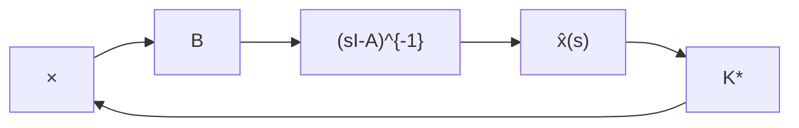

下面,我们来推导计算最优反馈阵 $K^{*}$ 的基本公式。为此,将 $G_{o}(s)$ 表为不可简约的 MFD $G_{o}(s)=N(s)D^{-1}(s)$ , 并设 $\det(R+G_{o}^{T}(-s)G_{o}(s))=0$ 的根 $\{\mu_{1},\cdots,\mu_{n}\}$ 为两两相异,且它们不是 $\det D(s)=0$ 的根。则由(11.286)可把闭环传递函数矩阵 $G_{f}(s)$ 进而表成为:

flowchart

图 11.24 LQ 问题的最优控制系统

```mermaid
graph TD
    A["v=0"] --> B["×"]
    B --> C["u"]
    C --> D["B"]
    D --> E["+"]
    E --> F["f"]
    F --> G["x"]
    G --> H["C"]
    H --> I["y"]
    I --> J["G̃₀(s)"]
    J --> K["×"]
    K --> L["A"]
    L --> M["f"]
    M --> N["x"]
    N --> O["C"]
    O --> P["G₀(s)"]
    P --> Q["×"]
    Q --> R["Aᵀ"]
    R --> S["f"]
    S --> T["x"]
    T --> U["Cᵀ"]
    U --> V["G̃₀(s)"]
    V --> W["×"]
    W --> X["Aᵀ"]
    X --> Y["f"]
    Y --> Z["x"]
    Z --> AA["Cᵀ"]
    AA --> AB["G₀(s)"]
    AB --> AC["×"]
    AC --> AD["Aᵀ"]
    AD --> AE["f"]
    AE --> AF["x"]
    AF --> AG["Cᵀ"]
    AG --> AH["G̃₀(s)"]
    AH --> AI["×"]
    AI --> AJ["Aᵀ"]
    AJ --> AK["f"]
    AK --> AL["x"]
    AL --> AM["Cᵀ"]
    AM --> AN["G₀(s)"]
    AN --> AO["×"]
    AO --> AP["Aᵀ"]
    AP --> AQ["f"]
    AQ --> AR["x"]
```

flowchart

图 11.25 LQ 问题最优控制系统的结构图

$$
\begin{array}{l} G _ {I} (s) = [ R + D ^ {- T} (- s) N ^ {T} (- s) N (s) D ^ {- 1} (s) ] ^ {- 1} (- D ^ {- T} (- s) N ^ {T} (- s) N (s) D ^ {- 1} (s)) \\ = \left[ D ^ {- T} (- s) \left(D ^ {T} (- s) R D (s) + N ^ {T} (- s) N (s)\right) D ^ {- 1} (s) \right] ^ {- 1} \\ \times (- D ^ {- T} (- s) N ^ {T} (- s) N (s) D ^ {- 1} (s)) \\ = \left[ \left(D ^ {T} (- s) R D (s) + N ^ {T} (- s) N (s)\right) D ^ {- 1} (s) \right] ^ {- 1} \left(- N ^ {T} (- s) N (s) D ^ {- 1} (s)\right) \tag {11.288} \\ \end{array}
$$

与此同时又有

$$
\begin{array}{l} \det \left(R + G _ {o} ^ {T} (- s) G _ {o} (s)\right) = \det \left(R + D ^ {- T} (- s) N ^ {T} (- s) N (s) D ^ {- 1} (s)\right) \\ = \det D ^ {- T} (- s) \det (D ^ {T} (- s) R D (s) + N ^ {T} (- s) N (s)) \det D ^ {- 1} (s) \\ = 0 \tag {11.289} \\ \end{array}
$$

但已知 $\det\left(R+G_{o}^{T}(-s)G_{o}(s)\right)=0$ 的根为 $\{\mu_{1},\cdots,\mu_{n}\}$ ，且它们不是 $\det D(s)=0$ 的根，再注意到

$$\det D ^ {- 1} (s) = 1 / \det D (s), \det D ^ {T} (- s) = \det D (- s) \tag {11.290}$$

所以可知 $\{\mu_{1},\cdots,\mu_{n}\}$ 也即为方程

$$\det (D ^ {T} (- s) R D (s) + N ^ {T} (- s) N (s)) = 0 \tag {11.291}$$

的 $n$ 个根。在此基础上，表受控系统为
