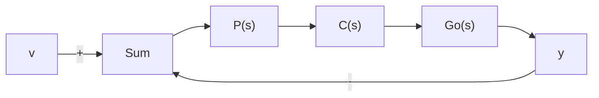
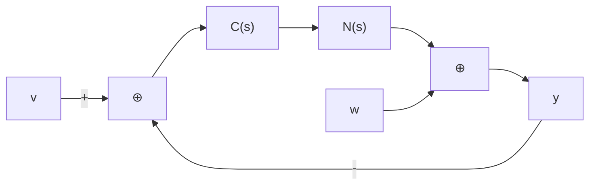

图 P11.3

flowchart

图 P11.4

11.16 给定受控系统和二次型性能指标为:

$$
\begin{array}{l} \dot {x} = \left[ \begin{array}{c c} 0 & 1 \\ 2 & - 3 \end{array} \right] x + \left[ \begin{array}{l} 0 \\ 1 \end{array} \right] u \\ J = \int_ {0} ^ {\infty} (x _ {1} ^ {2} + 4 x _ {2} ^ {2} + 2 u ^ {2}) d t \\ \end{array}
$$

利用复频率域法求出其最优状态反馈增益矩阵 $K^{*}$ 。
