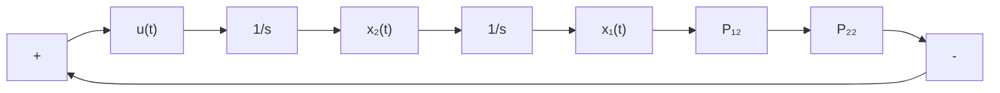

$$- \dot {\boldsymbol {P}} = \boldsymbol {P} \boldsymbol {A} + \boldsymbol {A} ^ {\mathrm{T}} \boldsymbol {P} - \boldsymbol {P} \boldsymbol {b r} ^ {- 1} \boldsymbol {b} ^ {\mathrm{T}} \boldsymbol {P} + \boldsymbol {Q}, \quad \boldsymbol {P} (t _ {f}) = \boldsymbol {F}$$

代入相应的 A, b, Q, r, F，并令矩阵

$$
\boldsymbol {P} (t) = \left[ \begin{array}{l l} P _ {1 1} & P _ {1 2} \\ P _ {1 2} & P _ {2 2} \end{array} \right]
$$

可得下列微分方程组及相应的边界条件：

$$\dot {P} _ {1 1} (t) = - 1 + P _ {1 2} ^ {2} (t), \quad P _ {1 1} (t _ {f}) = 0\dot {P} _ {1 2} (t) = - P _ {1 1} (t) + P _ {1 2} (t) P _ {2 2} (t), \quad P _ {1 2} (t _ {f}) = 0\dot {P} _ {2 2} (t) = - 2 P _ {1 2} (t) + P _ {2 2} ^ {2} (t), \quad P _ {2 2} (t _ {f}) = 0$$

利用计算机逆时间方向求解上述微分方程组，可以得到 $P(t), t \in [0, t_f]$ 。

最优控制

$$u ^ {*} (t) = - r ^ {- 1} \boldsymbol {b} ^ {\mathrm{T}} \boldsymbol {P x} (t) = - P _ {1 2} x _ {1} (t) - P _ {2 2} x _ {2} (t)$$

式中， $P_{12}$ 和 $P_{22}$ 随时间变化曲线如图 10-7 所示。由于反馈系数 $P_{12}$ 和 $P_{22}$ 都是时变的，在设计系统时，需离线算出 $P_{12}$ 和 $P_{22}$ 的值，并存储于计算机内，以便实现控制时调用。

最优控制系统的结构图如图 10-8 所示。

line

| t | P₂₂(t) | P₁₂(t) |
| --- | --- | --- |
| 0 | √2 | 1 |
| t_f | 0 | 0 |

图 10-7 里卡蒂方程解曲线( $t_{f}$ 相当大时)

flowchart

图 10-8 例 10-12 最优控制系统结构图

对于上述结论及例题求解过程,需要作如下几点说明:

1) 最优控制律(10-97)是一个线性状态反馈控制律,便于实现闭环最优控制。  
2) 里卡蒂方程(10-99)为非线性矩阵微分方程,通常只能采用计算机逆时间方向求数值解。由于里卡蒂方程与状态及控制变量无关,因而在定常系统情况下,可以离线算出 $P(t)$ 。  
3）只要时间区间 $[t_0, t_f]$ 是有限的，里卡蒂方程的解 $P(t)$ 就是时变的，最优反馈系统将成为线性时变系统，即使矩阵 $A, B, Q$ 和 $R$ 都是常值矩阵，求出的 $P(t)$ 仍然是时变的。
