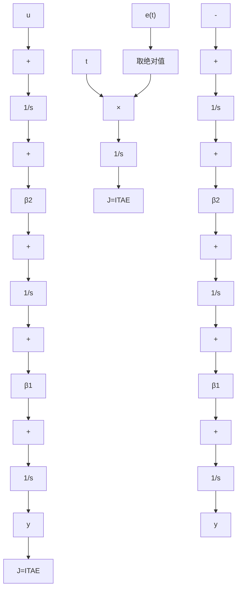

# 例 10-16 PID 控制系统的优化设计

在优化控制系统设计中,一种合适的性能指标是时间与绝对误差的乘积积分,称为 ITAE 性能指标,表示如下:

$$\mathrm{ITAE} = \int_ {0} ^ {t _ {f}} t | e (t) | \mathrm{d} t \tag {10-137}$$

选择 ITAE 指标,是为了减小较大的初始误差对性能指标取值的影响,同时也是为了强调最近的响应的影响。

当所选的性能指标达到极小值时,控制系统称为是最优的。如果稳定系统的闭环传递函数具有如下的一般形式:

$$\Phi (s) = \frac {Y (s)}{R (s)} = \frac {b _ {0}}{s ^ {n} + a _ {n - 1} s ^ {n - 1} + \cdots + a _ {1} s + a _ {0}} \tag {10-138}$$

式中， $a_0 = b_0$ ，则可以确定 $\Phi (s)$ 的最优系数，使系统对阶跃响应的ITAE性能指标极小。式(10-138)传递函数有 $n$ 个极点，没有零点，而且系统对阶跃响应的稳态误差为零。

在高阶线性系统中，ITAE最优性能指标的几何意义是误差的广义面积极小，它也是多维相空间曲面上的一个极值，它的维数就是该方程所描述系统的状态数。显然，用解析法很难得到该极值，一般采用实验的方法来确定 $\Phi(s)$ 的最优系数。

为了减少计算的复杂程度,不妨可以采用标准化微分方程形式,这样可以把 n 维空间降低为 n-1 维。例如,对于标准化时间 $\omega_{n}t$ , 标准二阶系统 $\Phi(s)=\frac{\omega_{n}^{2}}{s^{2}+\beta\omega_{n}s+\omega_{n}^{2}}=\frac{\omega_{n}^{2}}{s^{2}+2\zeta\omega_{n}s+\omega_{n}^{2}}$ 就只取

决于参数 $\beta = 2\zeta$ ，标准三阶系统 $\Phi (s) = \frac{\omega_n^3}{s^3 + \beta_2\omega_ns^2 + \beta_1\omega_ns^2 + \omega_n^3}$ 就只取决于 $\beta_{1}$ 和 $\beta_{2}$ 两个系数，依此类推。这里仅以三阶标准化微分方程所描述的系统在单位阶跃输入作用下的ITAE最优系数的确定方法为例，说明其基本实验原理。

不妨取 $\omega_{n} = 1$ ，则标准三阶系统的微分方程为

$$\ddot {y} + \beta_ {2} \ddot {y} + \beta_ {1} \dot {y} + y = 1$$

写成可控标准型形式

$$
\begin{array}{l} \left[ \begin{array}{l} \dot {x} _ {1} \\ \dot {x} _ {2} \\ \dot {x} _ {3} \end{array} \right] = \left[ \begin{array}{c c c} 0 & 1 & 0 \\ 0 & 0 & 1 \\ - 1 & - \beta_ {1} & - \beta_ {2} \end{array} \right] \left[ \begin{array}{l} x _ {1} \\ x _ {2} \\ x _ {3} \end{array} \right] + \left[ \begin{array}{l} 0 \\ 0 \\ 1 \end{array} \right] u \\ y = \left[ \begin{array}{l l l} 1 & 0 & 0 \end{array} \right] \left[ \begin{array}{l} x _ {1} \\ x _ {2} \\ x _ {3} \end{array} \right] \\ \end{array}
$$

其对应的状态变量图如图 10-9 中虚框所示。

flowchart

图 10-9 标准三阶系统可控标准型状态变量图及其 ITAE 指标实现

建立 ITAE 最优性能指标

$$\mathrm{ITAE} = \int_ {0} ^ {t _ {f}} t | e (t) | \mathrm{d} t$$
