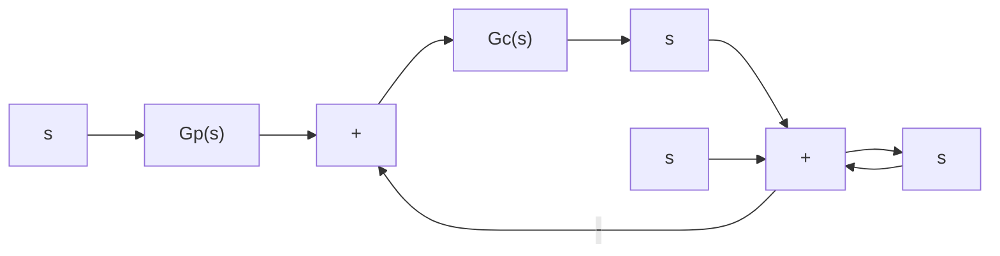

当系统 $\Phi(s)$ 具有表 10-4 所示的最优系数时，系统的阶跃响应如图 10-12 所示，其中时间尺度为标准化时间 $\omega_{n}t$ 。

对于斜坡输入,当闭环稳定系统传递函数具有如下标准形式:

$$\Phi (s) = \frac {b _ {1} s + b _ {0}}{s ^ {n} + a _ {n - 1} s ^ {n - 1} + \cdots + a _ {1} s + a _ {0}} \tag {10-139}$$

式中， $a_0 = b_0, a_1 = b_1$ ，则可由表10-5确定使ITAE指标极小化的最优系数。式(10-139)传递函数对斜坡输入的稳态误差为零。显然，系统相应的开环传递函数 $G(s)$ 应至少有两个纯积分环节。

表 10-5 对斜坡输入而言, 基于 ITAE 指标的 $\Phi(s)$ 的最优系数

$$
\begin{array}{r l} s ^ {2} + 3. 2 \omega_ {n} s + \omega_ {n} ^ {2} \\ s ^ {3} + 1. 7 5 \omega_ {n} s ^ {2} + 3. 2 5 \omega_ {n} ^ {2} s + \omega_ {n} ^ {3} \\ s ^ {4} + 2. 4 1 \omega_ {n} s ^ {3} + 4. 9 3 \omega_ {n} ^ {2} s ^ {2} + 5. 1 4 \omega_ {n} ^ {3} s + \omega_ {n} ^ {4} \\ s ^ {5} + 2. 1 9 \omega_ {n} s ^ {4} + 6. 5 0 \omega_ {n} ^ {2} s ^ {3} + 6. 3 0 \omega_ {n} ^ {3} s ^ {2} + 5. 2 4 \omega_ {n} ^ {4} s + \omega_ {n} ^ {5} \end{array}
$$

采用 ITAE 性能指标,以及表 10-4 或表 10-5 给出的最优系数,可以确定常用的 PID 控制器

$$G _ {c} (s) = K _ {1} + \frac {K _ {2}}{s} + K _ {3} s = \frac {K _ {3} s ^ {2} + K _ {1} s + K _ {2}}{s} \tag {10-140}$$

line

| 标准化时间 | n=2 | n=3 | n=4 | n=5 | n=6 |
| --- | --- | --- | --- | --- | --- |
| 0 | 0.0 | 0.0 | 0.0 | 0.0 | 0.0 |
| 2 | 0.8 | 0.7 | 0.6 | 0.5 | 0.4 |
| 4 | 1.05 | 1.0 | 0.95 | 0.9 | 0.85 |
| 6 | 1.0 | 1.0 | 1.0 | 1.0 | 1.0 |
| 8 | 1.0 | 1.0 | 1.0 | 1.0 | 1.0 |
| 10 | 1.0 | 1.0 | 1.0 | 1.0 | 1.0 |
| 12 | 1.0 | 1.0 | 1.0 | 1.0 | 1.0 |
| 14 | 1.0 | 1.0 | 1.0 | 1.0 | 1.0 |
| 16 | 1.0 | 1.0 | 1.0 | 1.0 | 1.0 |
| 18 | 1.0 | 1.0 | 1.0 | 1.0 | 1.0 |
| 20 | 1.0 | 1.0 | 1.0 | 1.0 | 1.0 |

图 10-12 传递函数具有标准形式且取最优系数时,系统关于标准化时间 $\omega_{n}t$ 的单位阶跃响应

的参数 $K_{1}, K_{2}$ 和 $K_{3}$ , 使系统的 ITAE 性能指标达到最小, 且对阶跃输入或斜坡输入的动态响应极好。采用 ITAE 方法时, PID 控制器的设计过程可以归纳如下:

1）根据对调节时间的要求，确定闭环系统的自然频率 $\omega_{n}$ 。  
2）根据选定的闭环最优系数(参见表10-4或表10-5)以及上一步给出的 $\omega_{n}$ ，确定PID控制器式(10-140)的三个参数 $K_{1}, K_{2}$ 和 $K_{3}$ ，从而得到 $G_{c}(s)$ 。  
3）确定合适的前置滤波器 $G_{p}(s)$ ，使得闭环传递函数的零点符合式(10-138)或式(10-139)的要求。

设控制系统如图 10-13 所示, 其中被控对象的传递函数为

$$G _ {0} (s) = \frac {4 0}{(s + 1) ^ {2}}$$

当 $G_{c}(s) = 1$ 时，系统为0型系统，静态位置误差系数 $K_{p} = 40$ ，在单位阶跃函数作用下，其稳态误差

$$e _ {s} (\infty) = \frac {1}{1 + K _ {p}} = 2.4$$

flowchart

图 10-13 带有期望输入 $R(s)$ 和扰动输入 $N(s)$ 的反馈控制系统

再由相应的闭环传递函数
